# **<u>第01章：LangChain 1.2 概述</u>** 

讲师：尚硅谷-宋红康 

官网：尚硅谷 

- **<u>1、为什么需要LangChain？</u>** 

**1.1 从传统应用到智能体时代** 


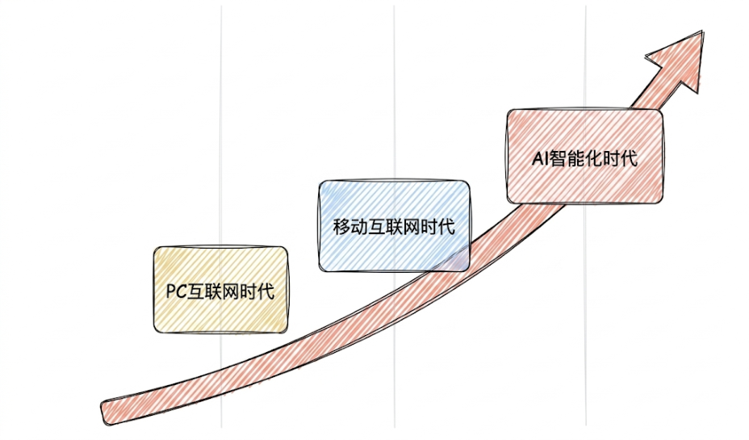


**1.2 单一的大语言模型的局限性** 


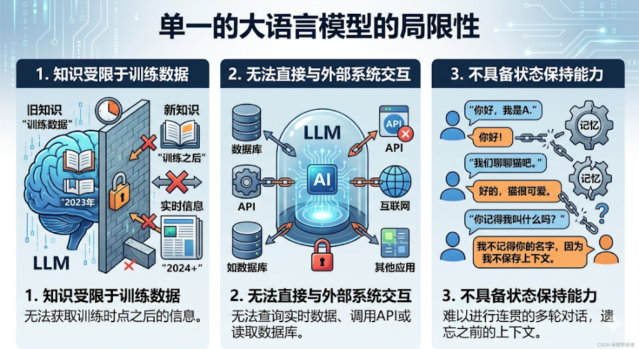


所以要构建真正实用的AI应用，必须将大语言模型与外部工具、数据源和记忆机制有机结合，从而催生 了LangChain框架的设计理念。 

LangChain，是当前构建生产级 AI 智能体系统的 **首选** 。 

### **1.3 LangChain框架的定位** 


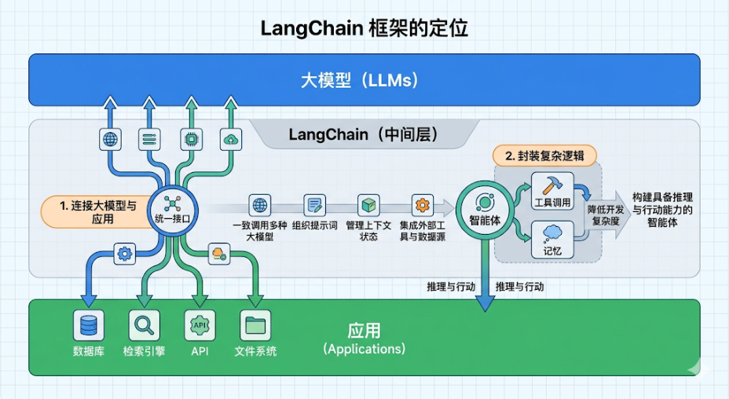


LangChain 作为大模型与应用间的中间层，可统一调用各类大模型、管理提示词与上下文，还能 集成外部工具和数据源，快速搭建具备推理、行动能力的智能体。 

核心定位三点： 

1. **打通大模型与外部资源** ：统一接口对接数据库、检索引擎、API、文件系统等； 

2. **封装底层复杂逻辑** ：抽象工具调用、记忆等能力，降低智能体开发难度； 

3. **支撑多智能体协作** ：依托 LangGraph 等生态，从单智能体拓展至多智能体协作，可构建工业 级智能体。 

### **1.4 LangChain的应用场景** 


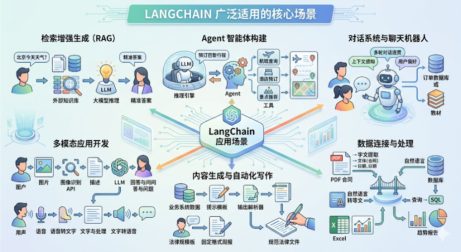


##### **1. 检索增强生成 (RAG)** 

**痛点：** 解决大模型知识滞后（无实时数据）和幻觉问题。 

**功能：** 检索外部知识库（文档/数据库）并向量化，让模型基于最新、最相关的资料回答。 

##### **2. Agent 智能体构建** 

- **痛点：** 解决 LLM 无法直接执行复杂任务的问题。 

- **功能：** 将模型作为“推理引擎”，自主规划路径并动态调用外部工具（如订票、查报告、写 SQL）， 实现复杂任务。 

##### **3. 对话系统与聊天机器人** 

- **痛点：** 解决多轮对话中的“记忆”流失问题。 

- **功能：** 集成记忆管理系统，记住用户偏好和历史交互，并结合私有数据（如教育教材、订单库）提 供专业服务。 

##### **4. 多模态应用开发** 

- **痛点：** 跨越单一文本交互的限制。 

**功能：** 融合图像识别、语音转文字等技术，让模型具备处理音视频和图片的综合推理能力。 

##### **5. 自动化写作与格式化生成** 

- **痛点：** 解决生成内容格式不标准、质量不稳定的问题。 

- **功能：** 配合提示词模板（Templates）与输出解析器（Parsers），自动产出规范的报告、合同或 邮件。 

##### **6. 数据连接与结构化处理** 

- **痛点：** 解决非结构化数据难以被模型直接利用的问题。 

- **功能：** 强大的数据连接能力使大模型能够与各种数据源和结构化数据交互。比如，从 PDF、Excel 中提取关键信息，或实现自然语言与 SQL 的自动转换。 

### **1.5 大模型相关岗位介绍** 


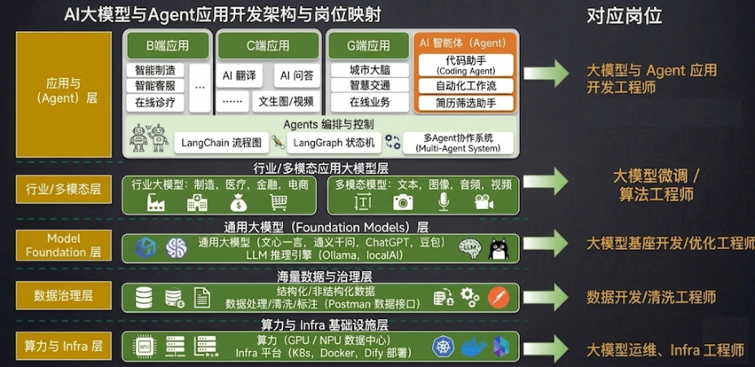


应用开发是大模型最值得关注的方向： **应用为王！** 


学习LangChain框架，高效开发大模型应用。 

## **<u>2、LangChain是什么？</u>** 

### **2.1 LangChain的发展时间线** 


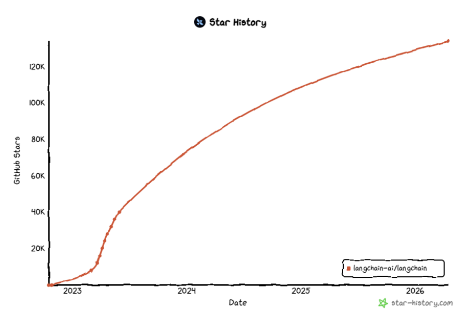


##### **第1阶段：诞生（2022年10月）** 

2022年10月，哈佛大学的机器学习项目工程师 Harrison Chase（哈里森·蔡斯） 创建了由大语言模型 驱动的应用程序的开源框架：LangChain。其名称来源于" Language "（语言模型）和" Chain "（链式 连接）的组合。体现了其核心设计理念—— **链接大语言模型与其他各种计算资源和数据，构建强大的AI 应用。** 

##### **第2阶段：探索期（2022年Q4—2023年Q1）** 

LangChain 初版发布，主要聚焦于PromptTemplate、LLMChain 等基础模块。其凭借前瞻性设计，在 开源社区迅速走红，Gitlub Star 数快速破万，成为早期最受关注的大模型应用框架。 

##### **第3阶段：体系化阶段（2023年Q2—2023年Q4）** 

引入 Tool、Agent、Retrieval 等概念，形成大模型+工具调用＋记忆的核心架构，支持构建完成更复杂 任务的自动化智能体。 

同期推出 LangChain Hub 与 LangSmith ，初步构建了从开发、调试到部署的生态闭环。 

##### **第4阶段：平台化阶段（2024年一2025年上半年）** 

LangGraph 与 LangServe 的发布是这一阶段的标志。LangGraph 为工作流管理提供了有向图基础， 而LangServe则解决了服务化部署的难题。至此，LangChain生态完成了从开发框架到智能体平台的跃 升。 

##### **第5阶段：深层智能体阶段（2025年下半年至今）** 

正式推出 Deep Agent ，官方定位为 Agent Harness（智能体执行框架） ，在LangGraph 和 LangChain 之上运行，标志着LangChain 生态进入新阶段，让开发者可构建基于多智能体的复杂化智能 体系统。 

### **2.2 LangChain的两个重要版本** 

##### **1、LangChain v0.3版本：既爱又恨** 

长期以来，LangChain 因为 API 变动频繁而被开发者戏称为“版本碎钞机”。 

一方面，2024年是LangChain架构重大变革的一年，LangChain团队推出了LangGraph作为底层智能体 编排框架，并 将原有的链和智能体标记为弃用 ，转而采用基于LangGraph构建的统一智能体抽象。 

另一方面，GPT-4逐渐普及，包括调用外部工具（Function calling）、结构化输出、系统提示词等功 能，都成了模型的基础功能。而对于开发者而言，此时再 使用LangChain再对这些功能进行封装就显得 多此一举 。 

此时，很多开发者的整体使用感受： 


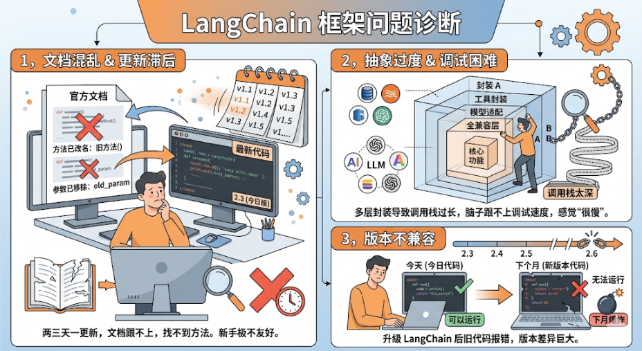


这个阶段，LangChain的开发者大规模流失。 

##### **2、LangChain v1.x版本：AI开发新范式** 

在经历了短暂的阵痛后，LangChain进行了一次彻底的架构重构与瘦身。 

2025年10月20日 ，LangChain团队正式发布了第一个正式大版本：LangChain v1.0.0与LangGraph v1.0.0，这是 AI 智能体（Agent）开发领域的 里程碑事件 ，标志着框架的成熟和标准化，为企业级AI应 用提供了稳定基础。 

官方首次明确 API 稳定保证： 承诺在 2.0 版本前无破坏性变更 。这种稳定性对于企业级应用，是至关 重要的。 

发布同期完成 1.2亿美元融资 ，估值超 12 亿美元，印证其作为 AI 基础设施的战略价值。 

**小结：对比 LangChain v0.3  与 LangChain v1.2（了解）** 

|**维度**|**LangChain v0.3**|**LangChain v1.2**|
|---|---|---|
|核心<br>架构与<br>设计理<br>念|过渡性版本，设计上以链（Chain）<br>为核心。|生产级稳定版本，标志着从“链式调用”到“智能<br>体框架”的范式转变。|
|Agent<br>构建方<br>式|依赖<br>initialize_agent 等旧版<br>API，基于<br>AgentExecutor 硬编<br>码。|官方推荐使用<br>create_agent 作为Agent的<br>标准构建入口，底层基于LangGraph。|
|工具定<br>义|通过<br>@tool 装饰器和<br>Tool 类定<br>义，类型安全性和参数验证能力较<br>弱。|支持通过Pydantic Schema定义工具，类型<br>安全，参数定义更清晰。|
|结构化<br>输出|主要依赖JSON Parser和正则表达<br>式，稳定性较差。|Structured Output 成为一等公民，直接绑<br>定Pydantic类，由模型底层保证输出格式稳<br>定性。|
|输出解<br>析|输出为纯文本，需通过正则匹配等<br>方式解析内容，较为繁琐且易出<br>错。|引入标准化的<br>content_blocks ，将模型输出<br>（推理、文本、工具调用）统一为标准对象，<br>无需再手动解析。|
|扩展机<br>制|缺乏系统性的扩展方式，修改逻辑<br>通常需要修改源码或提示词。|引入功能强大的<br>Middleware（中间件）系<br>统，允许在模型调用、工具执行等各生命周期<br>进行拦截和逻辑扩展。|
|多模态<br>支持|支持不完善，无法无缝集成图像、<br>音频等多模态数据。|完善了多模态适配，可轻松实现多模态对话、<br>多模态RAG等功能。|
|异步执<br>行性能|异步执行性能一般。|异步执行性能得到优化，据称响应速度提升<br>30%以上。|
|包结构<br>与依赖|包结构相对混乱，各模块耦合度较<br>高。<br>langchain 包为直接依赖。内<br>部从Pydantic v1升级到v2，对依<br>赖版本要求更严格。|包结构清晰，主<br>langchain 包保持轻量，旧<br>功能（如<br>Chains ）被迁移至<br>langchain-<br>classic 包。<br>@langchain/core 作为对等依<br>赖，版本管理更灵活。|
|Python<br>版本要<br>求|要求Python >= 3.9（停止支持<br>Python 3.8）。|要求 **Python >= 3.10**。|
|推荐用<br>途|适用于维护依赖v0.3的老旧项目，<br>不推荐用于新项目开发。|是<br>所有新项目和学习LangChain的首选版<br>本。官方承诺1.x版本系列不会引入破坏性<br>变更，保证了长期稳定性。|


### **2.3 LangChain v1.2的主要模块** 


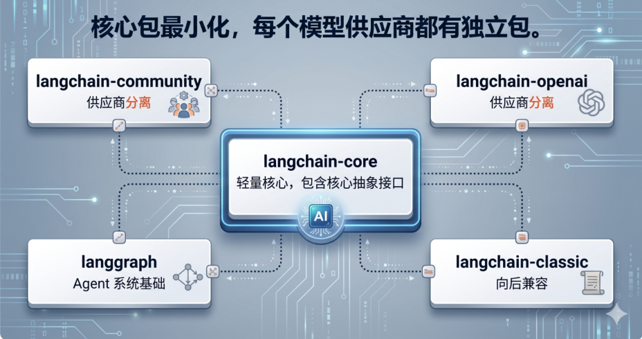


langchain-core ：官方推荐的核心API。比如 Runnable, BaseMessage等 langchain-classic ：冗余代码移或不推荐使用的经典API移到此。比如0.x中常用而1.x移除的API都 在这里。 

- langchain-community ：第三方集成，比如：合作伙伴包 langchain-openai，langchain- 

- anthropic等，按需安装、避免臃肿。 

- langgraph ：深度整合 LangGraph 1.0，协调多个Chain，Agent，Tools完成更复杂的任务，并 

- 且还支持循环调用，是langchain图形化的增强版 


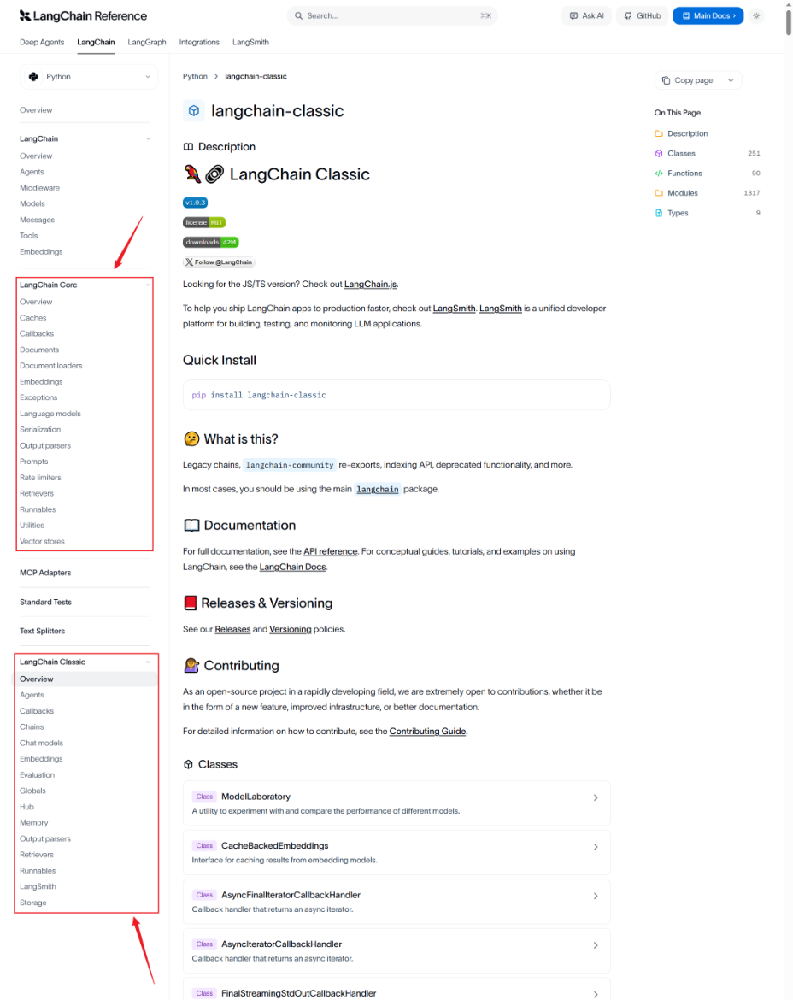


来自：https://reference.langchain.com/python/langchain/overview 

不要试图去学完LangChain的所有API，那是不可能的。 

你只需要搞懂它的核心逻辑与核心模块，其它的用到什么再去查什么。把它当成一个工具箱，而不 是一本教科书。 

### **2.4 API文档** 

官网：https://www.langchain.com/ 

Github地址：https://github.com/langchain-ai 

中文文档地址：https://docs.langchain.org.cn/oss/python/langchain/overview 

英文文档地址：https://docs.langchain.com/oss/python/langchain/overview 

API文档查询地址：https://reference.langchain.com/python/langchain/ 

## **<u>3、LangChain家族四大支柱</u>** 

截至2025年11月，LangChain 已从一个独立的开发框架，成长为一个覆盖智能体系统全生命周期的技术 生态。该生态由四大核心支柱构成： LangChain 、 LangGraph 、 Deep Agent 与 LangSmith 。 


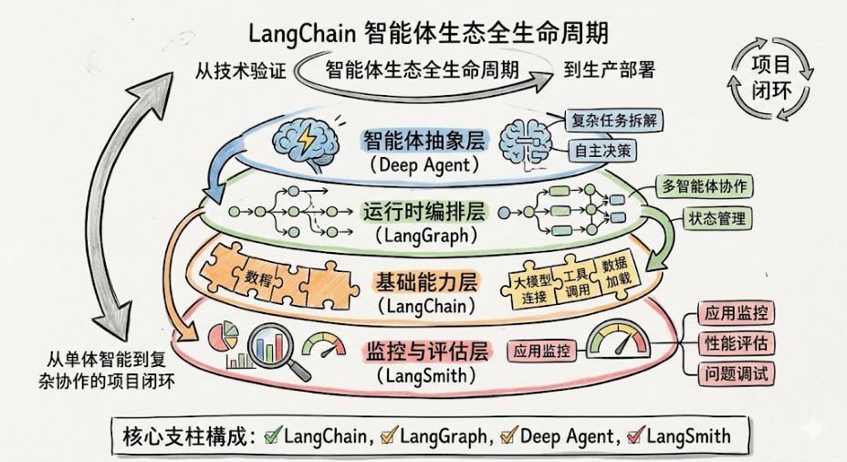


它们分别对应基础能力层、运行时编排层、智能体抽象层、监控与评估层，共同构建了一个从技术验证 到生产部署、从单体智能到复杂协作的项目闭环。 

官方文档的解释： 

<u>https://docs.LangChain.com/oss/python/concepts/products</u> 

### **3.1 LangChain：智能体开发的基石** 

LangChain 是整个生态的核心与起点，为开发者提供了模型调用、工具与中间件集成、智能体构建等一 整套基础能力。 

其核心价值如下： 

- 统一的模型抽象层 ：屏蔽了不同模型服务提供商（如OpenAI、Anthropic、Ollama 等）的接口 

- 差异，提供一致的调用方式。 

- 高度模块化的设计 ：使用 Message、Tool、Agent、Middleware 等组件实现灵活的组合与扩 

- 展。 

丰富的集成生态 ：预置了丰富的数据源、API、中间件等，构成了强大的AI能力枢纽。 

在整体架构中，LangChain 如同智能体的操作系统内核，是所有上层能力构建的基础。 

**结论：如果你需要构建简单的智能体应用，无需复杂的编排需求，那就选择LangChain。** 

### **3.2 LangGraph：复杂工作流的编排引擎** 

当智能体的任务从单一指令执行扩展为多步骤、有状态的复杂工作流时，LangGraph应运而生。 

其核心思想是 **将智能体内部抽象为一张有向图** 。 

- 节点（Node） ：代表独立的功能单元或决策点。 

边（Edge） ：定义了节点之间的流转条件与路径。 

状态（State） ：作为一个共享上下文，在节点间传递并持久化存储任务信息。 通过这种图式结构，LangGraph 让智能体的工作流节点交互变得显式、可控、可观测。 

官方也强调“快速起步用 LangChain，复杂控制用 LangGraph，二者并行协同”。 

##### **通俗理解：** 


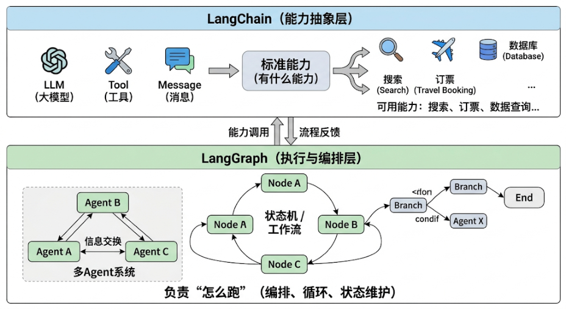


LangChain = 能力抽象层（LLM / Tool / Message 标准化），负责“有什么能力” 

LangGraph = 执行与编排层（状态机 / 工作流 / 多Agent系统），负责“怎么跑” 

### **3.3 Deep Agent：智能体的执行框架** 

Deep Agent 是新推出的全新组件，被定位为 Agent Harness（智能体执行框架）。它 **构建于 LangChain 与LangGraph 之上** ，增加了规划能力、文件系统、子 Agent 等高级功能。旨在让开发者 无须从零构建 复杂的控制逻辑，即可创建具备深度规划、长期记忆与多专家协作能力的智能体。 

Deep Agent 的核心能力如下： 

显式规划 ：自主生成、执行并动态调整多步任务计划。 虚拟文件系统 ：为智能体提供结构化的中间结果与知识存储。 子智能体 ：支持任务在多个智能体之间的分解与协作。 

长期记忆 ：通过与 LangGraph 状态存储的结合，实现跨对话的经验积累。 可扩展中间件 ：允许嵌入安全审计、性能监控或自定义业务逻辑。 

### **3.4 三者的关系** 

官方文档（三者对比）：https://docs.langchain.com/oss/python/langchain/overview 


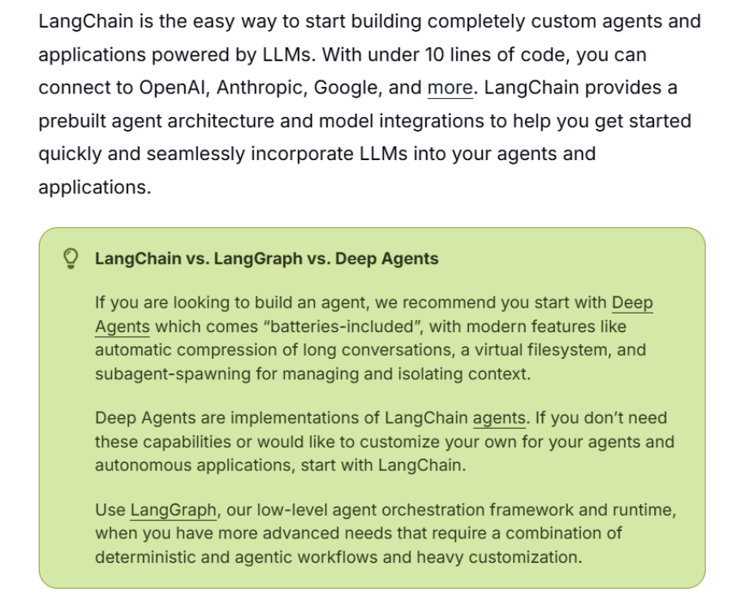


三个框架不是竞争关系，并非互斥，复杂项目完全可以同时用到这三层。 

**基于LLM的应用开发体系图：** 


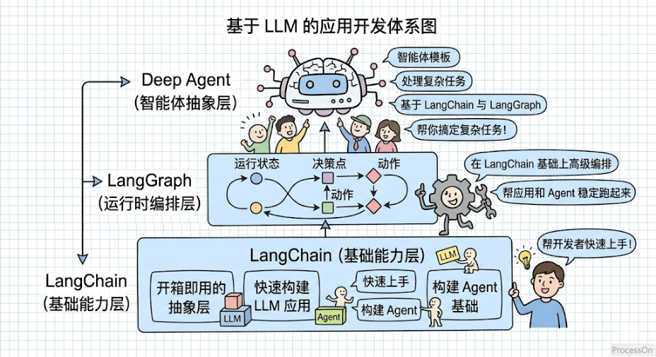


从 LangChain 快速搭建，用 LangGraph 打磨生产稳定性，再用 Deep Agents 赋予 Agent 更强的自主 能力——这才是完整的 LangChain 生态玩法。 

### **3.5 LangSmith：可视化监控与测试平台** 

当智能体系统逐渐复杂时，单靠日志与打印输出（print）调试已无法满足调试与质量管理的需求。 

LangSmith 是 LangChain 官方推出的 可视化监控与测试平台 ， **用于跟踪、记录和分析智能体在运行过 程中的完整调用链路** ，让智能体的内部运行过程变得透明和可评估。 


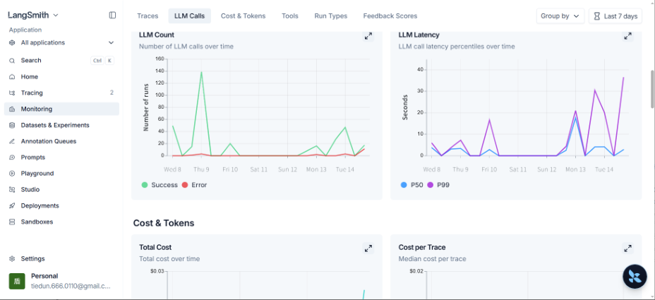


LangSmith 的核心目标如下： 

- 全链路追踪 ：可视化追踪模型调用、提示词输入、结果输出、工具使用等行为。 

调试与优化 ：发现运行中智能体的异常行为与性能瓶颈。 

- 评测与质量控制 ：支持人工与自动化评测，量化智能体表现。 

- 团队协作 ：支持多人共享测试集与调用记录。 

LangSmith官网：https://www.langchain.com/langsmith 

LangSmith 的引入使得智能体的开发、调试与运维形成了完整的质量闭环。 

## **<u>4、开发前的准备工作</u>** 

### **4.1 前置知识** 

##### **1、Python 基础语法** 

变量、流程控制、函数与参数机制、类与对象、装饰器 

- 常用的容器（列表、元组、集合、字典）、JSON处理、异常处理 

- 模块导入、包管理（推荐用 pip 或 conda ） 、线程与协程 

LangChain 生态支持包括 Python 和 JavaScript 语言实现。其中，Python 版本仍是功 能最完整、更新最及时、社区最活跃的核心实现。 

##### **2、大语言模型基础** 

了解什么是 LLM、Token、Prompt、Embedding 

- OpenAI API 或其他模型提供商，如 Anthropic、阿里云百炼、DeepSeek等 通过浏览器或app使用过大模型（比如：豆包、千问、DeepSeek等） 

### **4.2 相关环境安装** 

#### **4.2.1 代码管理方案** 

相较于 全局环境（系统环境） ，各个 虚拟环境 都有自己独立的一套：Python 解释器、pip 命令、第 三方依赖包，不和其它项目产生干扰。 


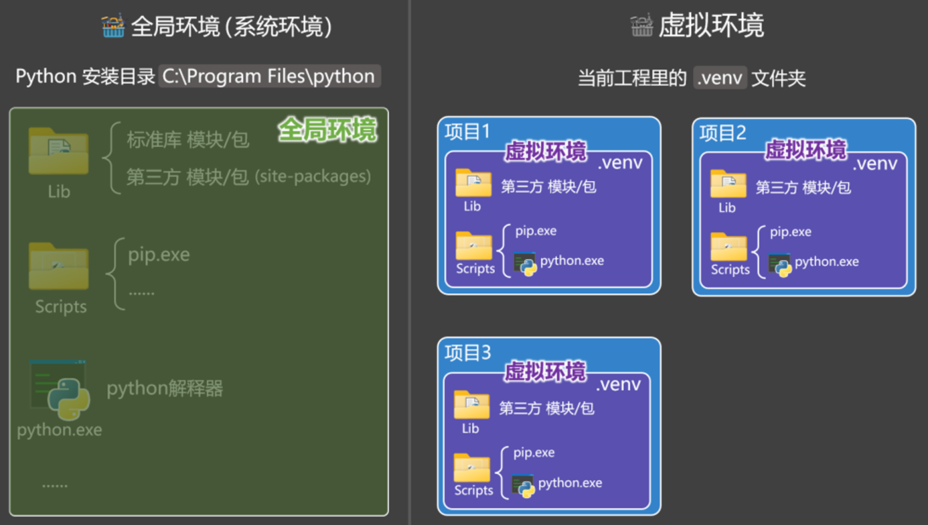


虚拟环境的设置方案： 

##### **方案1-使用conda：适合“Python + 非 Python 依赖”的复杂环境** 

conda 不只是 Python 包管理工具，它还可以管理 Python 解释器、Python 包，以及很多非 Python 依 赖，比如： CUDA、编译器、系统库、数据库驱动、科学计算底层库 等非 Python 依赖。 

因此在数据科学、深度学习、AI 工程、科学计算等场景中，conda 更稳妥、优先推荐。 

注意： **conda 环境中可以使用 pip，但建议先用 conda 装底层依赖，再用 pip 补充 Python 包，不要 随意反复交替使用** 。 

本套课程的选择。 

##### **方案2-使用uv：适合“纯 Python 项目”的现代包管理** 

uv 是一个现代 Python 包管理工具，主要 管理 Python 生态依赖 ，不能像 conda 那样管理 CUDA、系 统级数据库驱动、编译器这类通用非 Python 依赖。 

如果项目主要是普通 Python 开发，这类项目通常可以 **优先考虑 uv** 。例如： 

```
FastAPI 项目
LangChain 项目
脚本工具
Web 后端
普通 AI Agent 应用
RAG 应用层代码
```


**方案3-使用venv：Python 自带的轻量级虚拟环境工具** 

venv 是 Python 官方自带的虚拟环境工具，不需要额外安装。 

它的特点是简单、轻量： 

```
python -m venv .venv
```

**注意** ： venv 不负责安装新的 Python 解释器，只能基于当前已经安装好的 Python 解释器创建虚拟环 境。同时，venv 也不负责管理 CUDA、系统库等非 Python 依赖。 

##### **三者对比：** 

|**工具**|**管理 Python解释**<br>**器**|**管理**<br>**Python**<br>**包**|**管理非**<br>**Python依**<br>**赖**|**适合场景**|
|---|---|---|---|---|
|**conda**|✅可以|✅可以|✅可以|AI、深度学习、科学计算、复杂底<br>层依赖(C/C++，CUDA)|
|**uv**|✅可以|✅可以|❌不可以|纯Python项目、Web、Agent、<br>RAG应用层|
|**venv**|不支持原生安装，<br>基于已有解释器|✅可以|❌不可以|简单项目、教学演示、轻量隔离|


对于LangChain这样的纯Python环境，可以用uv，也可以用conda。本套课程选择使用conda。 

安装conda环境，见 《02资料\尚硅谷-conda使用指南.md》 

普通 Python 项目：可以用 uv，速度快，体验好。 

#### **4.2.2 安装虚拟环境与Python解释器** 

LangChain基于Python开发，因此需确保系统中安装了Python解释器，我们在创建虚拟环境过程中安装 Python解释器。 

LangChain 1.2版本要求Python版本为 3.10+以上 ，这里我们使用 python3.13.12 版本。 

注意：如下包的安装，必须显式指明版本，否则可能会出现不兼容情况。 

##### **1、创建conda环境：** 

```bash
# 创建一个名为 langchain1.2 的环境，指定 Python 版本是 3.13.12
conda create --name langchain1.2 python=3.13.12
# 查看 anconda 安装好的 python 环境
conda env list
# 初始化虚拟环境 ( 执行完此指令，重新启动命令行窗口 )
conda init 9
# 在命令行窗口切换到某 python 环境
conda activate langchain1.2 12 13 # 验证 python 版本
(langchain1.2) C:\Users\shkstart>python -V
# 或 调用： python --version
```


```
#输出：Python 3.12.13
```

##### **2、退出/删除conda环境：** 

```bash
# 在命令行退出当前 python 环境 2 (langchain1.2) C:\Users\shkst>conda deactivate
# 删除一个已有的 anconda 管理的 python 环境
conda remove --name langchain1.2 --all
```


#### **4.2.3 下载langchain安装包** 

##### 方式1：使用conda指令 （推荐） 

```bash
# 安装指定版本。比如 1.2.2
conda install langchain==1.2.12
# 或者安装最新版（默认仓库）
conda install langchain
# 指定频道（如 conda-forge ）
conda install -c conda-forge langchain==1.2.12
# 更新包
conda update langchain
# 卸载包
conda uninstall langchain
# 查看已安装包
conda list
```


conda 包通常来自 defaults 或 conda-forge。 

-c ：是 --channel 的缩写，conda用于指定包的安装来源渠道。 

conda-forge ：该源比官方默认渠道更新更快、包更全 

##### 方式2：使用pip指令 

```bash
# 安装指定版本
pip install langchain==1.2.12
# 安装最新版（不推荐）： pip install langchain
# 使用指定源：国内镜像加速 （解决下载慢） -i ：指定镜像源
pip install langchain==1.2.12 -i https://pypi.tuna.tsinghua.edu.cn/simple
```


```bash
# 从旧版本升级到新版本
pip install --upgrade langchain
# 或者 pip install -U langchain==1.2.12
# 卸载包
pip uninstall langchain
```


```
# 查看已安装包
pip list
```

**建议：优先 conda install，conda没有，再用pip install。** 

二者区别： 

conda依赖检查严格，pip相对宽松； 

conda 管环境 + 依赖 + 稳定性，pip 只管Python 包； 

conda：支持Python 包 + 非 Python 包；pip：只支持 Python 包。 

```bash
# 检查包来源
conda list # Conda 安装的包显示频道， pip 安装的显示 `pypi`
```


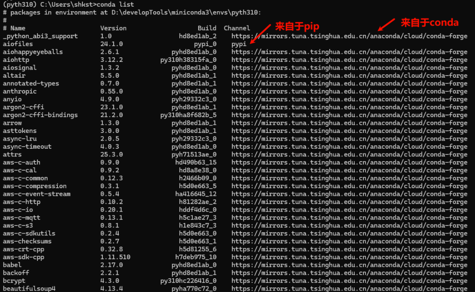


#### **4.2.4 PyCharm开发环境** 

PyCharm作为专业的Python IDE，具有强大的代码编辑、调试和版本控制功能。 


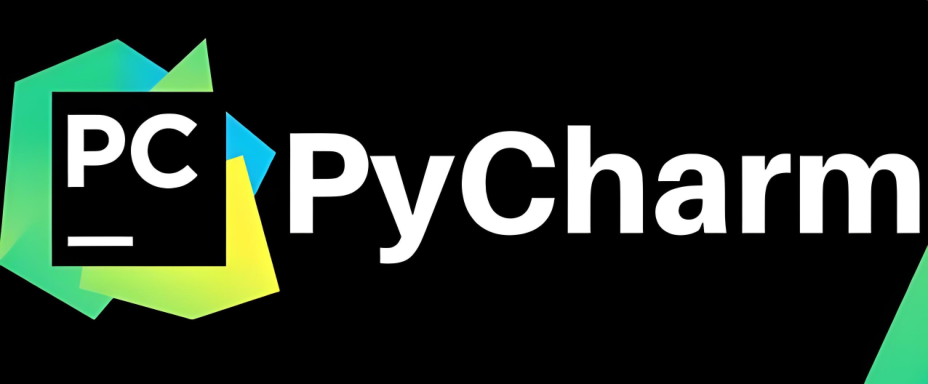


<u>https://www.jetbrains.com/pycharm/download/other/#releases-2025</u> 


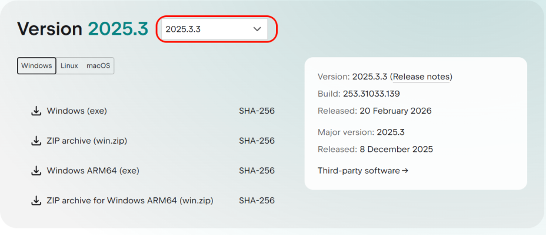


##### 创建新的工程，并设置Python解释器（选择Anaconda环境）。 


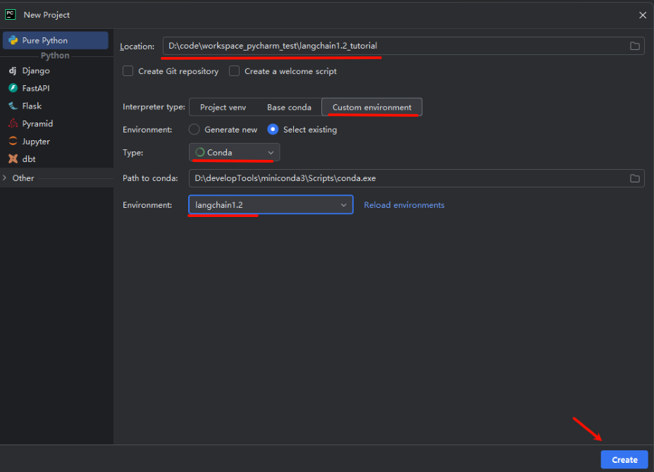


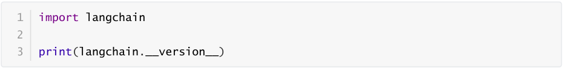


<!-- Start of picture text -->
1 import langchain<br>2<br>3 print(langchain.__version__)<br><!-- End of picture text -->

## **<u>5、大模型应用场景介绍</u>** 

大模型应用技术特点：门槛低，天花板高。 

### **5.1 RAG开发** 

**1）背景** 

大模型的知识冻结 ：随着 LLM 规模扩大，训练成本与周期相应增加，模型 无法实时学习 到最新的信 息或动态变化。导致 LLM 难以应对诸如“请推荐现在的热门影片”等时间敏感的问题。 

大模型幻觉 ：涉及到大模型从未在训练过程中学习过的信息时，大模型无法给出准确的答复，转而开 始臆想和编造答案。 

##### **2）举例** 

LLM在考试的时候面对陌生的领域，答复能力有限，然后就准备放飞自我了，而此时RAG给了一些提示 和思路，让LLM懂了开始往这个提示的方向做，最终考试的正确率从60%到了90%！ 


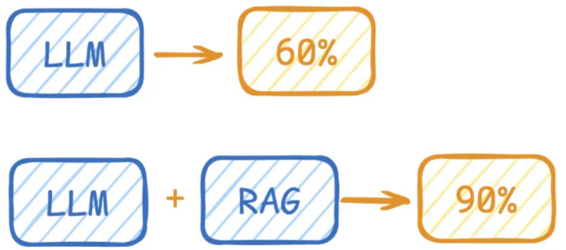


**3）何为RAG？** 

Retrieval-Augmented Generation（检索增强生成） 

图1： 


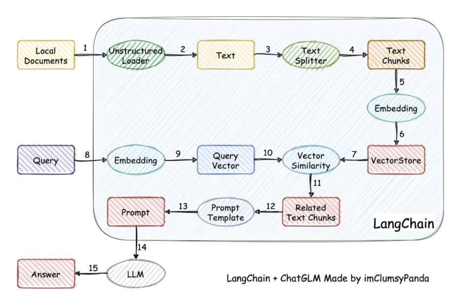


图2： 


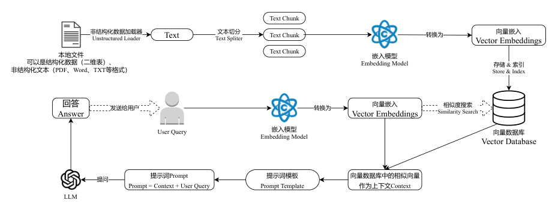


<!-- Start of picture text -->
Text Chunk<br>非结构化数据加载器 Unstructured Loader Text Text Spliter 文本切分 Text Chunk 转换为 Vector Embeddings 向量嵌入<br>本地文件 Text Chunk 嵌入模型<br>可以是结构化数据（二维表）、 Embedding Model 存储  &  索引<br>非结构化文本（ PDF 、 Word 、 TXT 等格式） Store & Index<br>回答 发送给 用 户 转换为 向量嵌入 相似度搜索<br>Answer Vector Embeddings Similarity Search<br>User Query 嵌入模型 向量数据库<br>Embedding Model<br>Vector Database<br>提问 提示词 Prompt 提示词模板 向量数据库中的相似向量<br>Prompt = Context + User Query Prompt Template 作为上下文 Context<br>LLM<br><!-- End of picture text -->

检索-增强-生成过程：检索可以理解为第10步，增强理解为第13步（这里的提示词包含检索到的数 据），生成理解为第15步。 


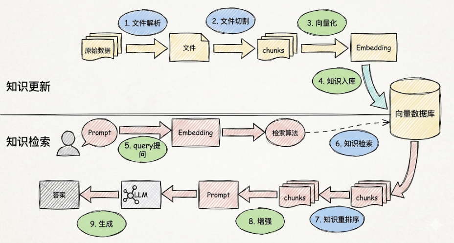


这些过程中的难点：1、文件解析 2、文件切割  3、知识检索   4、知识重排序 

- 1、文件解析：如果是pdf，内部包含文件、图片、表格，图片上还有文字，需要处理。 

- 2、文件切割：没有固定的格式 

- 3、在 RAG 应用中，随着文档数量增加，召回准确率会下降，引入reranker（重排器）可对初步 召回的较多 chunk（如 top 20 或 top 50）进行精排，提高召回准确率，防止LLM 处理无关信 息，减少时间和成本。 

- 此外，与基于基本矢量搜索的 RAG 相比，reranker增强型 RAG 的成本更高，但与仅依靠LLM 生 成答案相比，它的成本低些。 

##### **Reranker的使用场景：** 

- 适合：追求 回答高精度 和 高相关性 的场景中特别适合使用 Reranker，例如专业知识库或者客服 系统等应用。 

- 不适合：引入reranker会增加召回时间，增加检索延迟。服务对 响应时间要求高 时，使用 reranker可能不合适。 

### **5.2 Agent开发** 

充分利用 LLM 的推理决策能力，通过增加规划、记忆和工具调用的能力，构造一个能够独立思考、逐步 完成给定目标的 Agent（智能体）。 

类比举例： 


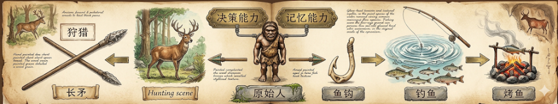


OpenAI的元老翁丽莲(Lilian Weng)于2023年6月在个人博客（https://lilianweng.github.io/posts/2023 -06-23-agent/）首次提出了现代AI Agent架构。 


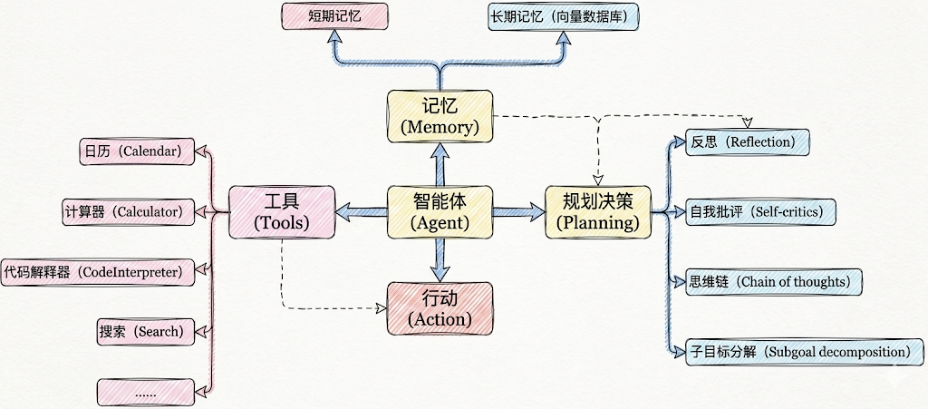


一个数学公式来表示： 

**Agent = LLM + Planning +  Tools + Memory + Action** 

比如，打车到西藏玩。 

大脑中枢：规划行程的你 

规划：步骤1：规划打车路线，步骤2：订饭店、酒店，。。。 

调用工具：调用MCP或FunctionCalling等API，滴滴打车、携程、美团订酒店饭店 

记忆能力：沟通时，要知道上下文。比如订酒店得知道是西藏路上的酒店，不能聊着聊着忘了最初 的目的。 

能够执行上述操作。说走就走，不能纸上谈兵。 

智能体核心要素被细化为以下模块： 

- **1、大模型（LLM）作为“大脑”** ：提供推理、规划和知识理解能力，是AI Agent的决策中枢。 

大脑主要由一个大型语言模型 LLM 组成，承担着信息处理和决策等功能， 并可以呈现推理和规划 的过程，能很好地应对未知任务。 

- **2、规划决策（Planning）** ：通过任务分解、反思与自省框架实现复杂任务处理。例如，利用思维链 （Chain of Thought）将目标拆解为子任务，并通过反馈优化策略。 


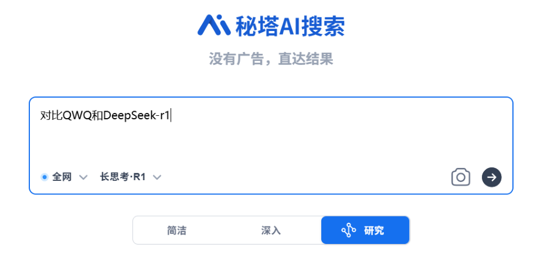


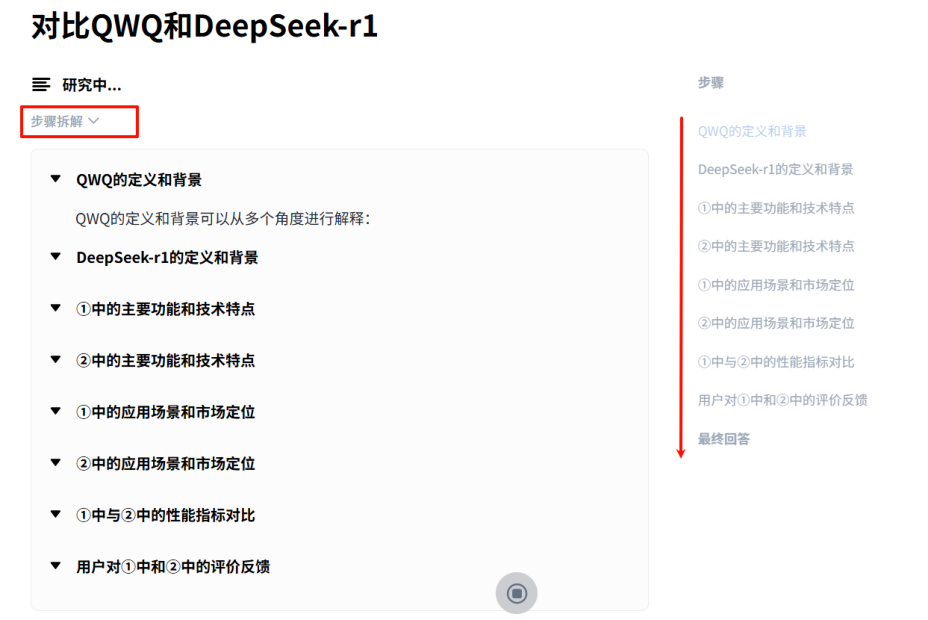


**3、工具使用（Tool Use）** ：调用外部工具（如API、数据库）扩展能力边界。 


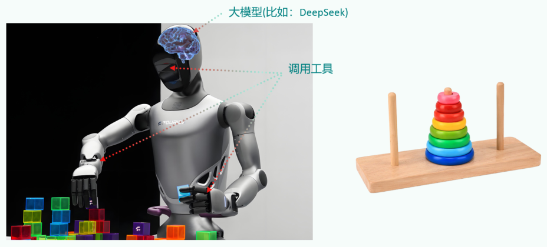


##### **4、记忆（Memory）** 

智能体像人类一样，能留存学到的知识以及交互习惯等，这样的机制能让智能体在处理重复工作时 调用以前的经验，从而避免用户进行大量重复交互。 

- **短期记忆** ：存储单次对话周期的上下文信息，属于临时信息存储机制。受限于模型的上下文窗口长 度。 


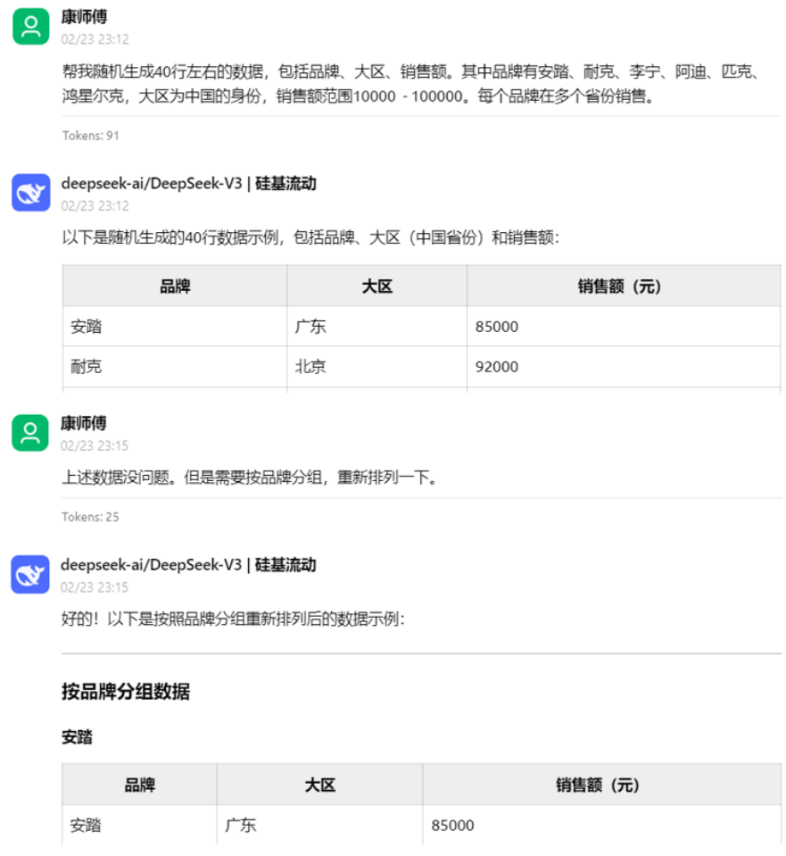


ChatGPT：支持约8k token的上下文 

GPT4：支持约32k token的上下文 

最新的很多大模型：OpenAI GPT‐5.5 / GPT‐5.4 Pro支持100 万 Token（1M）、Anthropic Claude Opus 4.7支持200 万 Token、DeepSeek‐V4‐Pro支持100 万 Token、甚至有模型支 持1000万 token的上下文 （相当于2000万字文本或20小时视频） 

**长期记忆** ：可以 横跨多个会话或时间周期 ，可存储并调用核心知识，非即时任务。 

- 比如，关于用户的偏好，过去执行过的指令等。 

- 长期记忆，可以通过 模型参数微调（固化知识） 、 知识图谱（结构化语义网络） 或 向量数 据库（相似性检索） 方式实现。 

- **5、行动（Action）** ：实际执行决策的模块，涵盖软件接口操作（如自动订票）和物理交互（如机器人 执行搬运）。比如：检索、推理、编程等。 

智能体会形成完整的计划流程。例如先读取以前工作的经验和记忆，之后规划子目标并使用相应工 具去处理问题，最后输出给用户并完成反思。 

### **5.3 大模型应用开发的4个场景** 

**场景1：纯 Prompt** 

Prompt是操作大模型的唯一接口 

当人看：你说一句，ta回一句，你再说一句，ta再回一句... 


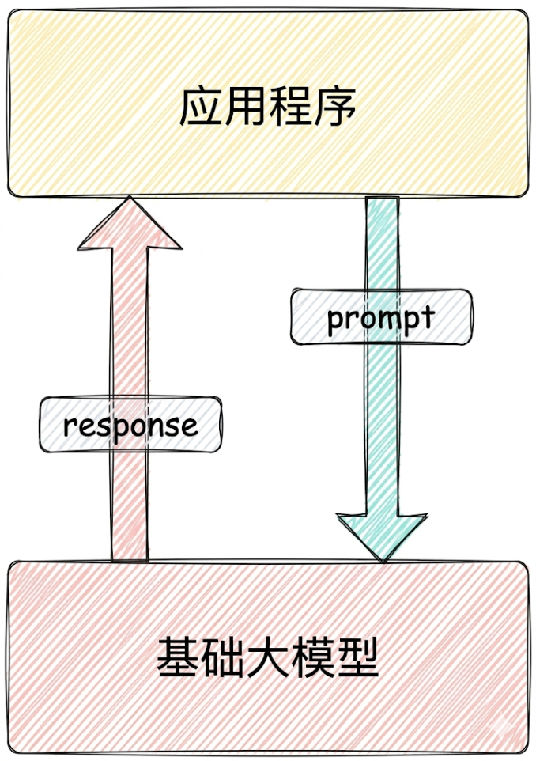


#### **场景2：Agent + Function Calling** 

- Agent：AI 主动提要求 

- Function Calling：需要对接外部系统时，AI 要求执行某个函数 

- 当人看：你问 ta「我明天去杭州出差，要带伞吗？」，ta 让你先看天气预报，你看了告诉ta，ta 再告诉你要不要带伞 


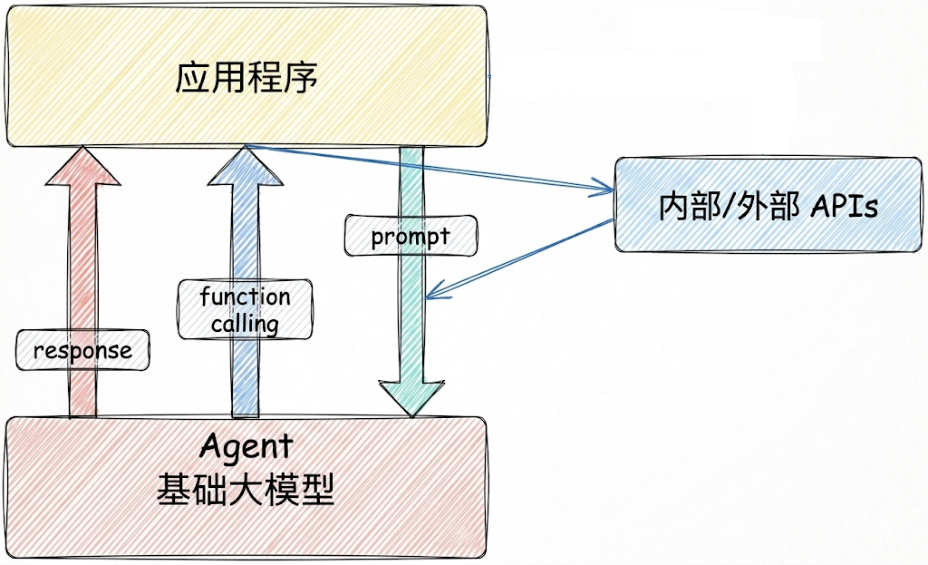


**场景3：RAG (Retrieval-Augmented Generation)** 

RAG：需要补充领域知识时使用 

- Embeddings：把文字转换为更易于相似度计算的编码。这种编码叫向量 向量数据库：把向量存起来，方便查找 

- 向量搜索：根据输入向量，找到最相似的向量 

举例：考试答题时，到书上找相关内容，再结合题目组成答案 


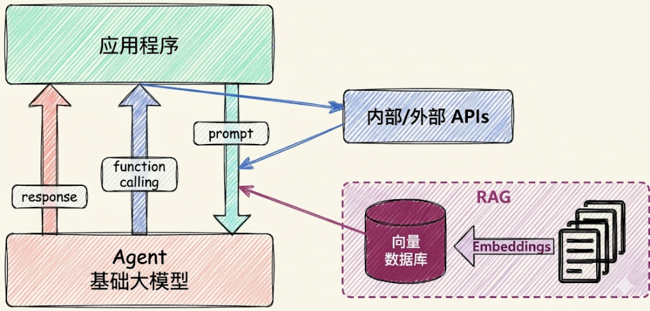


这个在智能客服上用的最广泛。 

**场景4：Fine-tuning(精调/微调)** 

举例：努力学习考试内容，长期记住，活学活用。 


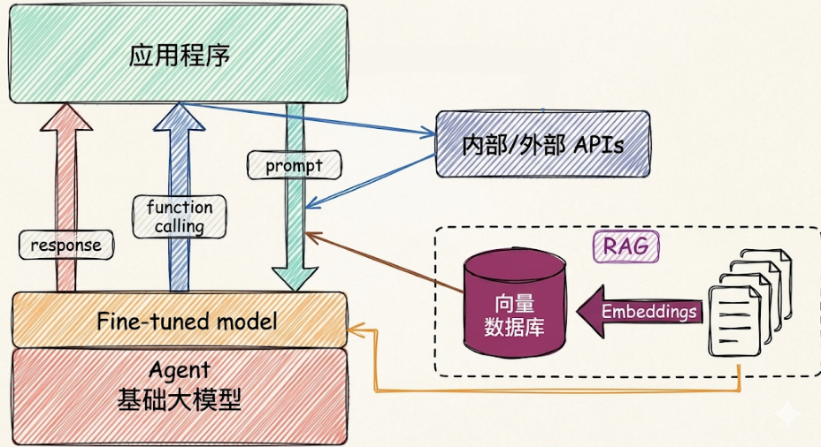


特点：成本最高；在前面的方式解决不了问题的情况下，再使用。 

**如何选择相关技术** 

面对一个需求，如何开始，如何选择技术方案？下面是个常用思路： 


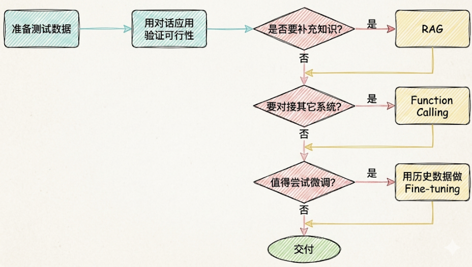
