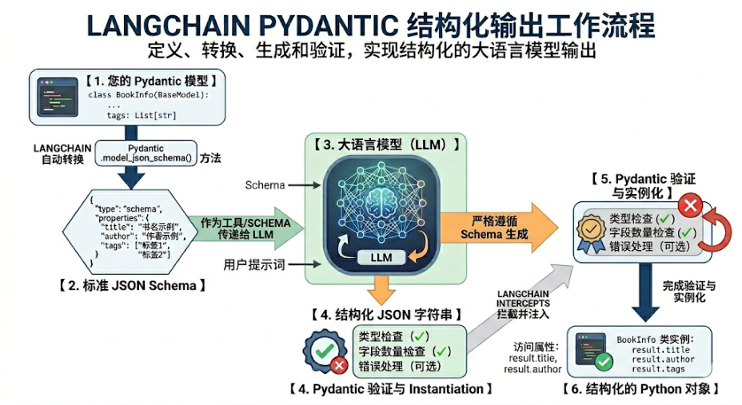
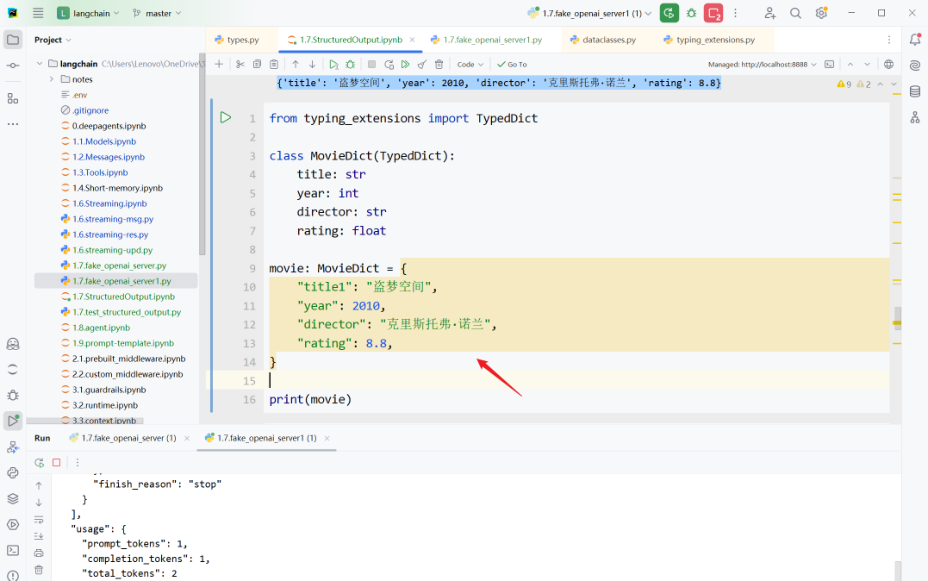

# **<u>第06章：结构化输出(Structured Output)</u>** 

讲师：尚硅谷-宋红康 

官网：尚硅谷 

- **<u>1、结构化输出概述</u>** 

### **1.1 什么是结构化输出** 

LangChain的结构化输出（Structured Output） 指的是： 

要求模型最终返回一个符合预定义结构的数据对象，例如固定字段的JSON、Pydantic 模型、 TypedDict，而不再是无格式的自然语言文本。 

它的核心目标是把“ 自然语言回答 ”变成“ 程序可以稳定消费的数据 ”。 

例如，不是让模型输出： 

盗梦空间在2010年上映，导演是克里斯托弗·诺兰，评分9.3。 

而是让它输出成类似这样的结构： 

```
{
"title": "盗梦空间",
"year": 2010,
"director": "克里斯托弗·诺兰",
"rating": 9.3
}
```

这样做的价值主要有三点： 

- **更容易被代码处理** ：下游系统可以直接读字段，而不是再从自然语言里做解析。 

- **结果更稳定** ：减少“模型说法变了但意思差不多”导致的解析失败。 

- **更适合工程化** ：适用于表单抽取、分类、路由、调用工具参数生成、工作流状态传递等场景。 

### **1.2 传统方式 vs 结构化输出** 

##### **1、传统的几种方式（繁琐、不推荐）** 

```python
# 1. 提示词要求 JSON
prompt = " 以 JSON 格式返回： {name, age, occupation}"
response = model.invoke(prompt)
# 2. 手动解析
import json
data = json.loads(response.content)
# 3. 手动验证类型
if not isinstance(data['age'], int):
raise ValueError("age must be int")
```


```
# 4. 手动创建对象
```


- `person = Person(**data)` 

##### **2、结构化输出（简洁）** 

# 一步到位


   - `structured_llm = model.with_structured_output(Person)` 

```
person = structured_llm.invoke(" 张三是一名 30 岁的软件工程师 ")
#` ✅ `自动解析、验证、创建对象
```


##### **为什么第2种结构化输出机制这么受欢迎？** 

在没有 Pydantic 等结构化方案之前，开发者需要写大量的 Prompt 苦口婆心地求大模型“请返回 JSON， 不要带任何解释”，然后自己写繁琐的 json.loads() 和 try...except 。 

而有了 Pydantic 等结构化方案结合 .with_structured_output() 之后： 

- **Prompt 变干净了：** 字段的 description 直接充当了 Prompt 的一部分。 

- **类型安全：** 编辑器能自动补全，代码运行前就能做类型检查。 

- **极其稳定：** 依托大模型厂商底层的 JSON 模式，输出错误率降到了极低。 

### **1.3 结构化输出模式** 

目前LangChain 1.x 支持多种Schema与结构化输出方式： 

- **Pydantic** （字段校验、描述、嵌套结构，功能最丰富） 

- **TypedDict** （轻量类型约束） 

- **JSON Schema** （与前后端/跨语言接口最通用） 

- **dataclass** 

模型对象可以调用 with_structured_output() 绑定 **输出模式** （schema）。 

只有 Pydantic 返回的是Schema类实例，其余三种方式返回的都是 字典 ；也只有 Pydantic 在类型不 匹配时会抛出异常。 

##### **问题：现在所有模型都支持“本章要讲解的结构化输出方式”吗？** 

大部分现代模型支持（通过函数调用）： 

- ✅ OpenAI (gpt-4, gpt-3.5-turbo) 

- ✅ Anthropic (claude-3) 

- ✅ Groq (llama-3) 

- ❌ 某些旧模型不支持 

如果不支持，LangChain 会回退到提示词 + JSON 解析。 

## **<u>2、四种模式的使用</u>** 

### **2.1 模式1：Pydantic** 

它通过在运行时强制执行类型提示，确保数据的正确性和一致性，是 生产场景首选 。 

#### **2.1.1 基本使用** 

需要满足的几个要素： 

- 所有结构化输出的数据模型都必须继承 BaseModel 

使用 类型提示 。Pydantic 支持丰富的字段类型：str 、int、float、List[xxx]、Optional[xxx]等 使用 Field() 添加字段默认值和描述，帮助 LLM 理解字段含义 

举例1： 

##### 1）大模型的初始化 

```python
from langchain.chat_models import init_chat_model
from dotenv import load_dotenv
import os
# 从 .env 文件中加载环境变量
load_dotenv(override=True)
CLOSEAI_API_KEY = os.getenv("CLOSEAI_API_KEY")
```


```
CLOSEAI_BASE_URL = os.getenv("CLOSEAI_BASE_URL")
```

```
model = init_chat_model(
```

```
model="gpt-5.4-mini",
model_provider="openai",
api_key=CLOSEAI_API_KEY,
base_url=CLOSEAI_BASE_URL
)
```

##### 2）定义 Pydantic 模型 

##### 使用清晰的字段描述；没有描述，LLM 可能格式错误 

```python
from pydantic import BaseModel, Field
```


```
classPerson(BaseModel):
"""人物信息"""
name: str = Field(description="姓名")
age: int = Field(description="年龄")
occupation: str = Field(description="职业")
```

LangChain 会要求 LLM 的输出必须能填充这些字段。 

- 3）使用 with_structured_output 即可引导模型进行结构化输出： 

```
# 创建结构化输出的 LLM
structured_llm = model.with_structured_output(Person)
# 调用 5 result = structured_llm.invoke(" 张三是一名 30 岁的软件工程师 ")
```


```
print(result)
print(type(result))
```

```
# result 是 Person 实例
print(result.name)       # "张三"
print(result.age)        # 30
print(result.occupation) # "软件工程师"
name='张三' age=30 occupation='软件工程师'
<class '__main__.Person'>
张三
软件工程师
```

说明：没有描述，LLM 可能格式错误。 

##### 举例2： 

```
frompydanticimportBaseModel, Field, SecretStr
classMovieModel(BaseModel):
"""
电影的详细信息
"""
title: str = Field(description="电影标题")
year: int = Field(description="电影上映年份")
director: str = Field(description="导演")
rating: float = Field(description="电影评分，满分十分")
model_with_structure = model.with_structured_output(MovieModel)
response = model_with_structure.invoke("给出盗梦空间的信息")
print(response)
print(type(response))
```

##### 输出 

```
title='盗梦空间' year=2010 director='克里斯托弗·诺兰' rating=9.3
<class '__main__.MovieModel'>
```

##### 举例3： 

```python
from pydantic import BaseModel, Field
# 定义输出结构
class SentimentAnalysis(BaseModel):
""" 情感分析结果 """
sentiment: str = Field(description=" 情感倾向： positive/negative/neutral")
confidence: float = Field(description=" 置信度， 0-1 之间 ")
keywords: list[str] = Field(description=" 关键词列表 ")
```


`8 9 10 #` ✅ `v1.x ：使用 with_structured_output 11 structured_model = model.with_structured_output(SentimentAnalysis) 12 13 # 调用 14 text = " 这个课程内容很实用，学到了很多知识，强烈推荐！ " 15 result = structured_model.invoke( 16 f" 分析以下文本的情感： \n{text}" 17 ) 18 19 print(f" 类型 : {type(result)}")  # <class 'SentimentAnalysis'> 20 print(f" 情感 : {result.sentiment}") 21 print(f" 置信度 : {result.confidence}") 22 print(f" 关键词 : {result.keywords}")` 

```
类型: <class '__main__.SentimentAnalysis'>
情感: positive
置信度: 0.99
关键词: ['实用', '学到了很多知识', '强烈推荐']
```

#### **2.1.2 高级特性** 

使用CloseAI平台的gpt模型： 

```python
from langchain.chat_models import init_chat_model
from dotenv import load_dotenv
import os
# 从 .env 文件中加载环境变量
load_dotenv(override=True)
```


```
CLOSEAI_API_KEY = os.getenv("CLOSEAI_API_KEY")
CLOSEAI_BASE_URL = os.getenv("CLOSEAI_BASE_URL")
```


```
model_with_closeai = init_chat_model(
model="gpt-5.4-mini",
model_provider="openai",
api_key=CLOSEAI_API_KEY,
base_url=CLOSEAI_BASE_URL
)
```

使用OpenRouter平台的gpt模型： 

```python
from langchain_openrouter import ChatOpenRouter
from dotenv import load_dotenv
import os
```


```
load_dotenv(override=True)
```


```
OPENROUTER_API_KEY = os.getenv("OPENROUTER_API_KEY")
OPENROUTER_API_BASE = os.getenv("OPENROUTER_API_BASE")
```


```
model_with_openrouter = ChatOpenRouter(
model="openai/gpt-5.4-mini",
api_key=OPENROUTER_API_KEY,
base_url=OPENROUTER_API_BASE,
)
```


##### **情况1：可选字段** 

##### **问题：LLM 未填充某些字段怎么办？** 

使用 Optional 指定字段为可选的。 

##### 举例： 

```python
from pydantic import BaseModel, Field
from typing import Optional
class Person(BaseModel):
""" 人物信息 """
name: str = Field(description=" 姓名 ")
age: int = Field(description=" 年龄 ")
occupation: str = Field(description=" 职业 ")
structured_llm = model_with_closeai.with_structured_output(Person)
structured_llm.invoke(" 张三是一名医生 ")
Person(name=' 张三 ', age=0, occupation=' 医生 ')
```


##### 作为对比： 

```python
from typing import Optional
from pydantic import BaseModel, Field
class Person(BaseModel): 5 """ 人物信息 """ 6 name: str = Field(description=" 姓名 ") 7 age: Optional[int] = Field(description=" 年龄 ")
occupation: str = Field(description=" 职业 ")
structured_llm = model_with_closeai.with_structured_output(Person)
structured_llm.invoke(" 张三是一名医生 ")
Person(name=' 张三 ', age=None, occupation=' 医生 ')
```


##### **情况2：默认值** 

LLM 未提供的信息会使用默认值。格式如下： 

Field(default="默认值", description="描述") 

注意：不同模型提供商对default字段的支持是不同的。 

举例1： 

使用CloseAI平台的gpt模型： 

```python
from typing import Optional 2 from pydantic import BaseModel, Field 3 4 class Person(BaseModel): 5 """ 人物信息 """ 6 name: str = Field(description=" 姓名 ") 7 age: int = Field(1,description=" 年龄 ") 8 occupation: str = Field(description=" 职业 ") 9
structured_llm = model_with_closeai.with_structured_output(Person) 11 12 structured_llm.invoke(" 张三是一名医生 ")
Person(name=' 张三 ', age=0, occupation=' 医生 ')
```


##### 作为对比： 

```python
from typing import Optional
from pydantic import BaseModel, Field
class Person(BaseModel):
""" 人物信息 """
name: str = Field(description=" 姓名 ")
age: int = Field(1,description=" 年龄 ")
occupation: str = Field(description=" 职业 ")
```


```
structured_llm = model_with_openrouter.with_structured_output(Person)
structured_llm.invoke("张三是一名医生")
```

```
Person(name=' 张三 ', age=1, occupation=' 医生 ')
```


##### 举例2： 

```
class Config(BaseModel): 2 timeout: Optional[int] = Field(30,description=" 超时时间 ( 单位秒 )") 3 retry: bool = Field(False,description=" 是否支持重试 ") 4 max_attempts: int = Field(6,description=" 最大重试次数 ") 5 6 # 测试
structured_llm = model_with_closeai.with_structured_output(Config) 8 structured_llm.invoke(" 配置要求：支持重试 , 最多重试 5 次 ")
Config(timeout=None, retry=True, max_attempts=5)
```


作为对比： 

```
class Config(BaseModel):
timeout: Optional[int] = Field(30,description=" 超时时间 ( 单位秒 )")
retry: bool = Field(False,description=" 是否支持重试 ")
max_attempts: int = Field(6,description=" 最大重试次数 ")
# 测试
structured_llm = model_with_openrouter.with_structured_output(Config)
structured_llm.invoke(" 配置要求：支持重试 , 最多重试 5 次 ")
```


```
Config(timeout=None, retry=True, max_attempts=5)
```

举例3： 

```python
from typing import Optional
from pydantic import BaseModel, Field
class Product(BaseModel):
""" 产品信息 """
name: str = Field(description=" 产品名称 ")
price: float = Field(description=" 价格 ")
description: Optional[str] = Field(description=" 产品描述 ")
stock: int = Field(default=100, description=" 库存 ")
# 测试
```


```
structured_llm = model_with_openrouter.with_structured_output(Product)
print("\n场景1：完整信息")
result1 = structured_llm.invoke("iPhone 15 售价 5999 元，最新款智能手机，库存 50
台")
print(result1)
```


```python
print("\n 场景 2 ：缺少描述和库存 ") 19 result2 = structured_llm.invoke("MacBook Pro 售价 12999 元 ") 20 print(result2) 21 22
场景 1 ：完整信息 2 name='iPhone 15' price=5999.0 description=' 最新款智能手机 ' stock=50 3 4 场景 2 ：缺少描述和库存 5 name='MacBook Pro' price=12999.0 description=None stock=100
```


**情况3：枚举类型** 

问题：如何限制字段的可选值？ 回答：使用枚举。 

举例1： 

```
fromenumimportEnum
classPriority(str, Enum):
LOW = "低"
MEDIUM = "中"
HIGH = "高"
classTask(BaseModel):
title: str
priority: Priority# 只能是 LOW/MEDIUM/HIGH
```

##### 举例2： 

```
fromenumimportEnum
classStatus(str, Enum):
ACTIVE = "激活"
INACTIVE = "未激活"
classUser(BaseModel):
status: Status# 只能是 ACTIVE 或 INACTIVE
```

##### 举例3： 

```
fromenumimportEnum
fromtypingimportOptional
frompydanticimportBaseModel, Field
# 定义你的优先级枚举类
classPriority(str, Enum):
LOW = "低"
MEDIUM = "中"
HIGH = "高"
classCustomerInfo(BaseModel):
"""客户信息"""
name: str = Field(description="客户姓名")
phone: str = Field(description="电话号码")
email: Optional[str] = Field(description="邮箱")
issue: str = Field(description="问题描述")
urgency: Priority = Field(description="紧急程度")
# 测试
structured_llm = model_with_openrouter.with_structured_output(CustomerInfo)
conversation = """
客服: 您好，请问有什么可以帮助您？
客户: 我是王小明，电话 138-1234-5678，我的订单一直没发货，很着急！
客服: 好的，我帮您查一下
"""
result = structured_llm.invoke(f"从以下客服对话中提取客户信息：\n{conversation}")
```

```
print(result)
```


```
print("\n提取结果：")
print(f"  客户: {result.name}")
print(f"  电话: {result.phone}")
print(f"  邮箱: {result.email or '未提供'}")
print(f"  问题: {result.issue}")
print(f"  紧急程度: {result.urgency.value}")
```

```
name='王小明' phone='138-1234-5678' email=None issue='订单一直没发货，很着急'
urgency=<Priority.HIGH: '高'>
提取结果：
客户: 王小明
电话: 138-1234-5678
邮箱: 未提供
问题: 订单一直没发货，很着急
紧急程度: 高
```

如果嫌单独定义一个 Enum 类太麻烦，也可以直接导入 typing 中的 Literal ，直接在字段里把允许 的值写死。 

```python
from typing import Optional, Literal
```


```
frompydanticimportBaseModel, Field
classCustomerInfo(BaseModel):
"""客户信息"""
name: str = Field(description="客户姓名")
phone: str = Field(description="电话号码")
email: Optional[str] = Field("未提供", description="邮箱")
issue: str = Field(description="问题描述")
# 使用 Literal 直接限定字面量值
urgency: Literal["低","中","高"] = Field(description="紧急程度")
# 测试
structured_llm = model_with_openrouter.with_structured_output(CustomerInfo)
conversation = """
客服: 您好，请问有什么可以帮助您？
客户: 我是王小明，电话 138-1234-5678，我的订单一直没发货，很着急！
客服: 好的，我帮您查一下
"""
result = structured_llm.invoke(f"从以下客服对话中提取客户信息：\n{conversation}")
print(result)
print("\n提取结果：")
print(f"  客户: {result.name}")
print(f"  电话: {result.phone}")
print(f"  邮箱: {result.email}")
print(f"  问题: {result.issue}")
print(f"  紧急程度: {result.urgency}")
```

```
name=' 王小明 ' phone='138-1234-5678' email=' 未提供 ' issue=' 订单一直没发货，很着 急 ' urgency=' 高 '
```


```
提取结果：
客户: 王小明
电话: 138-1234-5678
邮箱: 未提供
问题: 订单一直没发货，很着急
紧急程度: 高
```

##### 应用场景： 

自动填充 CRM 系统 工单自动分类 客服辅助 

##### **情况4：列表提取** 

##### 举例1： 

```
fromtypingimportList
classPerson(BaseModel):
"""人物信息"""
name: str
age: int
classPersonList(BaseModel):
"""人物列表信息"""
people: List[Person]  # 多个 Person 对象
structured_llm = model.with_structured_output(PersonList)
result = structured_llm.invoke("张三 30岁，李四 25岁")
print(result)
```

```
people=[Person(name=' 张三 ', age=30), Person(name=' 李四 ', age=25)]
```


##### 举例2：产品评论分析 

```python
class Review(BaseModel): 2 """ 产品评论 """ 3 product: str 4 rating: int = Field(description=" 评分 1-5") 5 pros: List[str] = Field(description=" 优点列表 ") 6 cons: List[str] = Field(description=" 缺点列表 ") 7
structured_llm = model.with_structured_output(Review) 9
review = structured_llm.invoke(""" 11 iPhone 17 很棒！摄像头强大，手感好。但是价格贵，没有充电器。 4 分。 12 """)
print(review)
product='iPhone 17' rating=4 pros=[' 摄像头强大 ', ' 手感好 '] cons=[' 价格贵 ', ' 没有充电器 ']
```


应用场景： 

批量处理用户评论 

自动生成分析报告 

发现产品改进点 

##### 举例3：文档信息提取 

```
classInvoice(BaseModel):
"""发票信息"""
invoice_number: str = Field(description="发票号")
date: str = Field(description="日期")
total_amount: float = Field(description="总金额")
items: List[str] = Field(description="商品")
# 测试
structured_llm = model.with_structured_output(Invoice)
invoice_text = """
发票号: INV-2024-001
日期: 2024-01-15
总金额: 1299.00
商品: MacBook Pro, AppleCare+
"""
invoice = structured_llm.invoke(f"提取发票信息：{invoice_text}")
print(invoice)
```

```
1invoice_number='INV-2024-001' date='2024-01-15' total_amount=1299.0
items=['MacBook Pro', 'AppleCare+']
```

##### 应用场景： 

- 自动化财务处理 

OCR 后结构化 数据录入 

**情况5：嵌套结构** 

##### 举例1： 

```
frompydanticimportBaseModel
classAddress(BaseModel):
"""地点描述"""
city: str
district: str
```

```
class Company(BaseModel):
""" 公司信息 """
name: str
address: Address # 嵌套模型
```


```
structured_llm = model.with_structured_output(Company)
```


```
result = structured_llm.invoke("阿里巴巴在杭州滨江区")
print(result)
```

```
name='阿里巴巴' address=Address(city='杭州', district='滨江区')
```

##### 举例2： 

```
frompydanticimportBaseModel, Field
fromtypingimportList
# 1. 定义嵌套的 Pydantic 模型
classActor(BaseModel):
"""演员信息"""
name: str = Field(description="演员姓名")
role: str = Field(description="饰演的角色")
classMovie(BaseModel):
"""电影信息"""
title: str = Field(description="电影标题")
year: int = Field(description="上映年份")
director: str = Field(description="导演")
cast: List[Actor] = Field(description="演员列表")  # 定义列表字段
rating: float = Field(description="评分")
# 2. 初始化模型并绑定输出结构
structured_model = model.with_structured_output(Movie)
# 3. 调用模型，直接获取 Movie 实例
response = structured_model.invoke("请介绍电影《盗梦空间》")
# 4. 访问嵌套数据
print(f"电影名: {response.title}")
print(f"上映年份: {response.year}")
print(f"导演: {response.director}")
print(f"演员列表: {response.cast}")
print(f"评分: {response.rating}")
```

以上代码输出结果如下： 

```
电影名: 盗梦空间
上映年份: 2010
导演: 克里斯托弗·诺兰
演员列表: [Actor(name='莱昂纳多·迪卡普里奥', role='柯布'), Actor(name='约瑟夫·
高登-莱维特', role='亚瑟'), Actor(name='艾伦·佩吉', role='阿里阿德涅'),
Actor(name='汤姆·哈迪', role='艾姆斯'), Actor(name='渡边谦', role='斋藤'),
Actor(name='玛丽昂·歌迪亚', role='梅尔')]
评分: 8.8
```

说明：LLM 能力有限，复杂嵌套结构可能会出错。所以建议： 

嵌套层级 ≤ 3 层 

```
classBad(BaseModel):
user: User
company: Company
address: Address
country: Country# 4 层嵌套，容易出错
```

使用清晰的 description 

必要时拆分成多个调用 

举例3： 

```
frompydanticimportBaseModel
fromtypingimportList
classAspect(BaseModel):
"""评论维度"""
name: str = Field(description="维度名称，如：质量、价格、服务")
score: int = Field(description="评分，1-5")
comment: str = Field(description="具体评价")
classProductReview(BaseModel):
"""产品评论分析"""
overall_sentiment: str = Field(description="整体情感：
positive/negative/neutral")
overall_score: int = Field(description="综合评分，1-5")
aspects: List[Aspect] = Field(description="各维度评价")
summary: str = Field(description="一句话总结")
# 创建结构化模型
structured_model = model.with_structured_output(ProductReview)
# 测试
review_text = """
这款笔记本电脑性能非常强大，运行大型软件毫无压力。
屏幕色彩鲜艳，看视频很舒服。
不过价格有点贵，而且风扇噪音较大。
客服态度很好，物流也快。
总体来说还是值得购买的。
"""
```


```
result = structured_model.invoke(
f"分析以下产品评论：\n{review_text}"
)
print(f"整体情感: {result.overall_sentiment}")
print(f"综合评分: {result.overall_score}/5")
print(f"\n各维度评价:")
foraspectinresult.aspects:
print(f"  - {aspect.name}: {aspect.score}/5 - {aspect.comment}")
print(f"\n总结: {result.summary}")
```

```
整体情感: positive
综合评分: 4/5
各维度评价:
- 性能: 5/5 - 性能非常强大，运行大型软件毫无压力。
- 屏幕: 5/5 - 屏幕色彩鲜艳，看视频很舒服。
- 价格: 2/5 - 价格有点贵，性价比略受影响。
- 噪音: 2/5 - 风扇噪音较大，影响使用体验。
- 服务: 5/5 - 客服态度很好，物流也快。
总结: 整体表现优秀，性能和屏幕突出，服务也好，但价格偏高且风扇噪音较大。
```

**情况6：限制条件** 

举例1： 

```
frompydanticimportValidationError
classUser(BaseModel):
name: str = Field(min_length=2, max_length=20)
age: int = Field(ge=0, le=150)
email: str
print("\n有效数据:")
try:
user = User(name="张三", age=30, email="zhang@example.com")
print(f"[OK] {user.name}, {user.age}, {user.email}")
exceptValidationErrorase:
print(f"[FAIL] {e}")
print("\n无效数据（年龄超出范围）:")
try:
user = User(name="李四", age=200, email="li@example.com")
print(f"[OK] {user}")
exceptValidationErrorase:
print(f"[FAIL] 验证失败（符合预期）: {e.errors()[0]['msg']}")
```

```
有效数据:
[OK] 张三, 30, zhang@example.com
无效数据（年龄超出范围）:
[FAIL] 验证失败（符合预期）: Input should be less than or equal to 150
```

举例2： 

使用CloseAI平台模型 

```
class Product(BaseModel):
""" 产品信息（严格验证） """
name: str = Field(description=" 产品名称（字符串类型） ", min_length=2)
price: float = Field(description=" 价格，数字类型 ", gt=0)
stock: int = Field(description=" 库存，整数类型 ", ge=0)
```


```python
# 测试
structured_llm = model_with_closeai.with_structured_output(Product)
11 # response = structured_llm.invoke(" 华为 mate 80 promax 价格是 7999 ，当前库存 100")
response = structured_llm.invoke(" 华为 mate 80 promax 价格是 -7999 ，当前库 存 -100")
print(response)
name=' 华为 mate 80 promax' price=7999.0 stock=100
```


使用OpenRouter平台模型 

```python
class Product(BaseModel): 2 """ 产品信息（严格验证） """ 3 name: str = Field(description=" 产品名称（字符串类型） ", min_length=2) 4 price: float = Field(description=" 价格，数字类型 ", gt=0)
stock: int = Field(description=" 库存，整数类型 ", ge=0)
# 测试
structured_llm = model_with_openrouter.with_structured_output(Product)
11 # response = structured_llm.invoke(" 华为 mate 80 promax 价格是 7999 ，当前库存 100")
response = structured_llm.invoke(" 华为 mate 80 promax 价格是 -7999 ，当前库 存 -100")
print(response)
name=' 华为 mate 80 promax' price=1.0 stock=0
```


#### **2.1.3 工作流程图解** 





##### **第1步：定义结构** 

##### 比如： 

```python
from pydantic import BaseModel, Field
class BookInfo(BaseModel):
title: str = Field(description=" 书名 ")
author: str = Field(description=" 作者名字 ")
tags: list[str] = Field(description=" 书籍的标签或分类 ")
```


##### **第2步：协议转换** 

LangChain 内部会调用 Pydantic 的底层方法（如 model_json_schema() ），将你写的 Python 代码 **自 动转换成标准的 JSON Schema** 。 

这个 JSON Schema 是一段严格的 JSON 文本，详细描述了有哪些字段、字段类型是什么（ string , array 等）以及字段的描述（ description ）。 

##### **第3步：模型交互与强约束** 

LangChain 会将这个 JSON Schema 包装进给大模型的 API 请求中。 

- 现代方法（ .with_structured_output ）： 现代大模型（如 OpenAI、Anthropic、Gemini 等）普 遍支持“函数调用/工具调用（Function/Tool Calling）”或“JSON Mode”。LangChain 会把 JSON Schema 作为 Tools 传入。 

- 大模型侧的约束： 像 OpenAI 的 strict=True 参数，会启动模型的 **语法采样约束（Grammarbased sampling）** 。大模型在解码生成 token 时，不是瞎猜，而是严格按照 JSON Schema 的语 法树进行选择，从而在 **模型底层级** 保证了输出格式绝不走样。 

##### **第4步：自动解析与验证** 

当大模型返回符合 JSON 规范的字符串后，LangChain 的 PydanticStructuredOutputParser （解析 器）会接管工作： 

1. **解析（Parsing）：** 将字符串解析为 Python 字典。 

2. **验证（Validation）：** 将字典喂给你的 Pydantic 模型。Pydantic 会自动检查数据类型是否正确。 如果模型漏掉了必填字段，或者类型错误，这里会直接抛出验证错误（或者触发 LangChain 的重 试机制）。 

3. **返回（Return）：** 如果通过验证，你拿到的不再是冷冰冰的字符串，而是一个 **直接可以点出属性 的 Python Pydantic 对象** （例如 result.title ）。 

### **2.2 模式2：TypedDict** 

#### **2.2.1 什么是 TypedDict** 

TypedDict 是 Python 3.8+ 引入的一种类型提示工具， **即带有类型声明的字典结构** 。适合需要快速定义 字典结构且无需 Pydantic 重量级功能的场景。 

##### 1、 普通 dict 没有类型信息： 

```
{
"title": "盗梦空间",
"year": 2010,
"director": "克里斯托弗·诺兰",
"rating": 9.3
}
```

- 2、 TypedDict 可以进一步说明： 

   - 这个字典应该有哪些字段 

每个字段的类型是什么 

TypedDict 主要是 **类型声明** ，不是运行时强校验器。 

举例： 

```
fromtyping_extensionsimportTypedDict
classMovieDict(TypedDict):
title: str
year: int
director: str
rating: float
movie: MovieDict = {
"title1": "盗梦空间",
"year": 2010,
"director": "克里斯托弗·诺兰",
"rating": 8.8,
}
print(movie)
```

实例化字典时给出的字段名称和TypedDict不完全一致，此时IDE的静态类型检查会标记。 





##### 但不会导致运行时异常，输出如下所示 

```json
{ 2 'title1': ': '' 3 'year': 2010, 4 'director': ': '' 5 'rating': 8.8 6 }
'title1': ': '' 盗梦空间 ',
'director': ': '' 克里斯托弗 · 诺兰 ',
```


#### **2.2.2 基本使用** 

##### **Annotated的使用** 

Annotated 用来在“类型”之外，再附加一些额外信息，即 **元数据** 。类似于 Pydantic 的 Field 。 

##### **基本形式：** 

```
Annotated[ 类型 , 附加信息 1, 附加信息 2, ...]
```


##### **举例的前提：** 

使用CloseAI平台的gpt模型： 

```python
from langchain.chat_models import init_chat_model
from dotenv import load_dotenv
import os
# 从 .env 文件中加载环境变量
load_dotenv(override=True)
CLOSEAI_API_KEY = os.getenv("CLOSEAI_API_KEY")
CLOSEAI_BASE_URL = os.getenv("CLOSEAI_BASE_URL")
model_with_closeai = init_chat_model(
```


```
model="gpt-5.4-mini",
model_provider="openai",
api_key=CLOSEAI_API_KEY,
base_url=CLOSEAI_BASE_URL
)
```

##### 使用OpenRouter平台的gpt模型： 

```python
from langchain_openrouter import ChatOpenRouter
from dotenv import load_dotenv
import os
load_dotenv(override=True)
```


```
OPENROUTER_API_KEY = os.getenv("OPENROUTER_API_KEY")
OPENROUTER_API_BASE = os.getenv("OPENROUTER_API_BASE")
model_with_openrouter = ChatOpenRouter(
model="openai/gpt-5.4-mini",
api_key=OPENROUTER_API_KEY,
base_url=OPENROUTER_API_BASE,
)
```

##### **举例1：返回简单结构** 

```
"""
使用 TypedDict 模型定义结构化输出
"""
fromtyping_extensionsimportTypedDict, Annotated
classMovieTypedDict(TypedDict):
"""
电影的详细信息
"""
title: Annotated[str, "电影的正式名称，例如《盗梦空间》"]
year: Annotated[int, "电影的公映年份，使用四位数字表示"]
director: Annotated[str, "电影导演的全名"]
rating: Annotated[float, "电影在10分制下的评分，可包含一位小数"]
# 设置模型结构化输出
structured_llm  = model_with_closeai.with_structured_output(MovieTypedDict)
# 调用模型并获取结构化输出
response = structured_llm.invoke("给我介绍下电影《星际穿越》")
print(type(response))
print(response)
```

##### 输出如下： 

```
<class'dict'>
{'title': '星际穿越', 'year': 2014, 'director': '克里斯托弗·诺兰', 'rating':
.6}
```

**举例2：返回嵌套结构** 

```
fromtypingimportTypedDict, List, Annotated
# 使用TypedDict定义嵌套结构
classActor(TypedDict):
"""演员情况"""
name: Annotated[str, "演员姓名"]
role: Annotated[str, "饰演的角色"]
classMovie(TypedDict):
"""电影情况"""
title: Annotated[str, "电影标题"]
year: Annotated[int, "上映年份"]
director: Annotated[str, "导演"]
cast: Annotated[List[Actor], "演员列表"]  # 嵌套列表定义
rating: Annotated[float, "评分"]
# 设置模型结构化输出
structured_llm  = model_with_closeai.with_structured_output(Movie)
# 调用模型并获取结构化输出
resp = structured_llm.invoke("给我介绍下电影《盗梦空间》")
# 访问嵌套数据
print(f"电影名: {resp['title']}")
print(f"上映年份: {resp['year']}")
print(f"导演: {resp['director']}")
print(f"演员列表:{resp['cast']}")
print(f"评分: {resp['rating']}")
```

##### 输出如下： 

```
电影名: 盗梦空间
上映年份: 2010
导演: 克里斯托弗·诺兰
演员列表:[{'name': '莱昂纳多·迪卡普里奥', 'role': '多姆·柯布'}, {'name': '约瑟
夫·高登-莱维特', 'role': '亚瑟'}, {'name': '艾伦·佩吉', 'role': '阿里阿德涅'},
{'name': '汤姆·哈迪', 'role': '伊姆斯'}, {'name': '渡边谦', 'role': '斋藤'}]
评分: 8.8
```

##### **举例3：...的使用** 

##### 说明：与模型提供商有关系 

使用CloseAI平台gpt模型： 

```
fromtyping_extensionsimportTypedDict, Annotated
classMovieDict(TypedDict):
"""
电影的详细信息
"""
title: Annotated[str, ..., "电影标题"]
year: Annotated[int, ..., "电影上映年份"]
director: Annotated[str, ..., "导演"]
rating: Annotated[float, ..., "电影评分，满分十分"]
```

```
model_with_structure = model_with_closeai.with_structured_output(MovieDict)
response = model_with_structure.invoke("根据这段话抽取盗梦空间的信息，不包含的信息
可以留空：盗梦空间在2010年上映，导演是克里斯托弗·诺兰。")
print(response)
print(type(response))
```

##### 输出 

```
{'title': '盗梦空间', 'year': 2010, 'director': '克里斯托弗·诺兰'}
<class'dict'>
```

使用OpenRouter平台gpt模型： 

```
fromtyping_extensionsimportTypedDict, Annotated
classMovieDict(TypedDict):
"""
电影的详细信息
"""
title: Annotated[str, ..., "电影标题"]
year: Annotated[int, ..., "电影上映年份"]
director: Annotated[str, ..., "导演"]
rating: Annotated[float, ..., "电影评分，满分十分"]
model_with_structure =
model_with_openrouter.with_structured_output(MovieDict)
response = model_with_structure.invoke("根据这段话抽取盗梦空间的信息，不包含的信息
可以留空：盗梦空间在2010年上映，导演是克里斯托弗·诺兰。")
print(response)
print(type(response))
```

##### 输出 

```
{'title': '盗梦空间', 'year': 2010, 'director': '克里斯托弗·诺兰', 'rating':
}
<class 'dict'>
```

说明：上述代码的 ... 是Python的字面量，等价于 Ellipsis ，可以理解为占位符。下游框架（如 LangChain）可以对 ... 作定制化处理，如LangChain中Annotated的 ... 表示当前字段是必须存在的， 不可省略，用来指示模型的输出。 

再比如： 

```
fromtyping_extensionsimportTypedDict, Annotated
classMovieDict(TypedDict):
"""
电影的详细信息
"""
title: Annotated[str, ..., "电影标题"]
year: Annotated[int, ..., "电影上映年份"]
director: Annotated[str, Ellipsis, "导演"]
rating: Annotated[float, "电影评分，满分十分"]
```


```python
model_with_structure = model.with_structured_output(MovieDict)
response = model_with_structure.invoke(" 根据这段话抽取盗梦空间的信息，不包含的信息 必须留空：盗梦空间上映于 2010 年，我们并不知道它的导演是谁。 ")
print(response)
print(type(response))
```


输出 

```
{'title': '盗梦空间', 'year': 2010, 'director': ''}
<class'dict'>
```

director 和 rating 的信息都是缺失的，但是前者被标记为 **必填** ，因此输出的字典包含该字段但是值为 空字符串，而 rating 字段被省略了。 

### **2.3 模式3：JSON Schema** 

这种方式需要按照JSON Schema规范拼接JSON字符串，比较繁琐，并且缺少校验机制。不推荐。 

**举例1：返回简单结构** 

模型初始化： 

```
fromlangchain.chat_modelsimportinit_chat_model
fromdotenvimportload_dotenv
importos
# 从.env文件中加载环境变量
load_dotenv(override=True)
CLOSEAI_API_KEY = os.getenv("CLOSEAI_API_KEY")
CLOSEAI_BASE_URL = os.getenv("CLOSEAI_BASE_URL")
model = init_chat_model(
model="gpt-5.4-mini",
model_provider="openai",
api_key=CLOSEAI_API_KEY,
base_url=CLOSEAI_BASE_URL
)
```

```
json_schema = {
"title": "Movie",
"description": "A movie with details",
"type": "object",
"properties": {
"title": {
"type": "string",
"description": "The title of the movie"
},
"year": {
"type": "integer",
"description": "The year the movie was released"
},
"director": {
```

```
"type": "string",
"description": "The director of the movie"
},
"rating": {
"type": "number",
"description": "The movie's rating out of 10"
}
},
"required": ["title", "year", "director", "rating"]
}
structured_model = model.with_structured_output(
json_schema,
method="json_schema"
)
response = structured_model.invoke("给出盗梦空间的信息")
print(response)
print(type(response))
```

输出如下： 

```
{'title': '盗梦空间', 'year': 2010, 'director': '克里斯托弗·诺兰', 'rating':
.8}
<class 'dict'>
```

说明： 

- 1、 **method：** 结构化输出的方式，但是否可用，依赖于模型供应商及Langchain适配器的具体实现。比 如，DeepSeek模型服务不支持json_shema模式。 

**json_schema：** 使用模型供应商提供的专用结构化输出功能。 

- 2、以上代码中定义json_schema的时候指定的title、description、type、properties、required是遵循 JSON Schema 规范的标准关键字，是固定写法。几个关键字的解释如下： 

   - title ：为整个 Schema 或特定属性提供一个人类可读的标题，不能是中文，用于提高可读性。 description ：提供更详细的文字描述，说明 Schema 或属性的用途等，和 title一样，旨在帮助理 

   - 解。 

   - type ：定义当前数据节点必须是什么数据类型。常见类型有 string, number, integer, boolean, 

   - object, array, null。object即是json对象。 

   - properties ：用于定义JSON 对象（Object）中可以包含哪些属性（键），以及每个属性对应的值 

   - 类型和说明。 

   - required ：当 type为 "object"时使用，是一个数组，列出了对象中必须存在的属性名。 

##### **举例2：返回嵌套结构** 

```
"""
使用 JSON Schema 定义嵌套结构
"""
# 1. 定义嵌套的 JSON Schema
project_schema = {
"title": "MovieInfo",
"description": "包含电影标题、上映年份、导演、演员和评分的电影对象",
"type": "object",
"properties": {
"title": {"type": "string", "description": "电影标题"},
```

```
"year": {"type": "integer", "description": "上映年份"},
"director": {"type": "string", "description": "导演"},
"cast": {  # 定义嵌套数组
"type": "array",
"description": "演员列表",
"items": {
"type": "object",
"properties": {
"name": {"type": "string", "description": "演员姓名"},
"role": {"type": "string", "description": "演员角色"}
},
"required": ["name", "role"]
}
},
"rating": {"type": "number", "description": "评分（10分制）"}
},
"required": ["title", "year", "director", "cast", "rating"]
}
# 绑定 JSON Schema 到模型
structured_model = model.with_structured_output(project_schema)
# 调用模型
response = structured_model.invoke("生成一个关于《星际穿越》的电影信息，包含导演、演
员、评分")
print(response)
```

输出如下： 

```
{
'title': '星际穿越',
'year': 2014,
'director': '克里斯托弗·诺兰',
'rating': 8.6,
'cast': [{
'name': '马修·麦康纳',
'role': '库珀'
}, {
'name': '安妮·海瑟薇',
'role': '艾米莉亚·布兰德'
}, {
'name': '杰西卡·查斯坦',
'role': '墨菲·库珀（成年）'
}, {
'name': '迈克尔·凯恩',
'role': '布兰德教授'
}, {
'name': '马特·达蒙',
'role': '曼恩博士'
}, {
'name': '麦肯吉·弗依',
'role': '墨菲·库珀（10岁）'
}, {
'name': '蒂莫西·柴勒梅德',
'role': '汤姆·库珀（15岁）'
}, {
'name': '卡西·阿弗莱克',
```

```
'role': '汤姆·库珀（成年）'
}]
}
```

### **2.4 模式4：@dataclass** 

@dataclass是 Python 标准库 dataclasses 提供的类装饰器，用于简化“以字段为核心”的数据类定义。 

给类加上 @dataclass 后，Python 会根据字段声明自动生成常用方法，例如： 

__init__ __repr__ __eq__ 

因此，从 **对象行为** 上看， @dataclass 创建的类，常常 近似于 手写这些方法的普通类。 

```
fromdataclassesimportdataclass
@dataclass
classMovie:
title: str
year: int
director: str
rating: float
```

这类写法的主要价值是：让“数据结构定义”更简洁、更清晰。 

##### **注意：** 

虽然 @dataclass 在行为上接近于手写 __init__ 、 __repr__ 、 __eq__ 的普通类，但二者 **并不完全等 价** 。 @dataclass 修饰后的类仍然是普通的python类，但它会被标准库标记为 **数据类** ，并携带 dataclass的字段元信息，手写 __init__ 等方法的普通类不能替代@dataclass修饰的类。 

前者可以作为Langchain的Schema，而后者不行。 

举例： 

模型的初始化： 

```python
from langchain.chat_models import init_chat_model
```


```
fromdotenvimportload_dotenv
importos
# 从.env文件中加载环境变量
load_dotenv(override=True)
```

```python
CLOSEAI_API_KEY = os.getenv("CLOSEAI_API_KEY")
CLOSEAI_BASE_URL = os.getenv("CLOSEAI_BASE_URL")
11 model = init_chat_model( 12 model="gpt-5.4-mini", 13 model_provider="openai", 14 api_key=CLOSEAI_API_KEY, 15 base_url=CLOSEAI_BASE_URL 16 )
from dataclasses import dataclass
from pydantic import Field
```


```
@dataclass
classMovie():
"""
电影的详细信息
"""
title: str = Field(description="电影标题")
year: int = Field(description="电影上映年份")
director: str = Field(description="导演")
rating: float = Field(description="电影评分，满分十分")
structured_model = model.with_structured_output(Movie)
response = structured_model.invoke("给出盗梦空间的信息")
print(response)
print(type(response))
```

输出 

```
{'title': '盗梦空间', 'year': 2010, 'director': '克里斯托弗·诺兰', 'rating': 8.8}
<class 'dict'>
```

@dataclass作为schema，返回的是 **未经校验的字典** 。 

## **<u>3、关于类型校验</u>** 

验证不同schema定义方式在数据格式不匹配时的处理方式。 

### **3.1 fake server** 

我们构造一个虚拟的DeepSeek服务端，客户端接收到的响应是 人为构造 的，主要目的是为了观察不同 模式下LangChain会从响应中的哪些字段中抽取信息。 

服务器端如下： 

```python
import json
import time
from http.server import BaseHTTPRequestHandler, HTTPServer
class FakeDeepSeekHandler(BaseHTTPRequestHandler):
def do_POST(self):
content_length = int(self.headers.get("Content-Length", 0))
raw_body = self.rfile.read(content_length).decode("utf-8")
print("\n" + "=" * 100)
json_body = None
try:
json_body = json.loads(raw_body)
print("[JSON BODY]")
print(json.dumps(json_body, ensure_ascii=False, indent=2))
except Exception as e:
print("[JSON PARSE ERROR]")
```


```
print(repr(e))
# 固定返回一个普通 JSON 字符串
response = {
"id": "chatcmpl-test",
"object": "chat.completion",
"created": int(time.time()),
"model": "any",
"choices": [
{
"index": 0,
"message": {
"role": "assistant",
"content": "",
"tool_calls": [
{
"id": "call_1",
"type": "function",
"function": {
"name": json_body["tools"][0]
["function"]["name"],
"arguments": json.dumps(
{'title1': '盗梦空间', 'year2': 2010,
'director': '克里斯托弗·诺兰',
'rating': 9.3},
ensure_ascii=False
)
}
}
]
},
"finish_reason": "stop"
}
],
"usage": {
"prompt_tokens": 1,
"completion_tokens": 1,
"total_tokens": 2
}
}
print("\n"+"="*100)
print("[RESPONSE]")
print(json.dumps(response, ensure_ascii=False, indent=2))
body = json.dumps(response, ensure_ascii=False).encode("utf-8")
self.send_response(200)
self.send_header("Content-Type", "application/json; charset=utf-8")
self.send_header("Content-Length", str(len(body)))
self.end_headers()
self.wfile.write(body)
deflog_message(self, format, *args):
pass
```

```
defmain():
server = HTTPServer(("127.0.0.1", 8889), FakeDeepSeekHandler)
print("Fake DeepSeek server running at http://127.0.0.1:8889")
server.serve_forever()
if__name__ == "__main__":
main()
```

不必关注代码实现，只需要知道我们返回的核心内容是 

```
{
'title1': '盗梦空间',
'year2': 2010,
'director': '克里斯托弗·诺兰',
'rating': 9.3
}
```

LangChain客户端希望模型返回的是 

```
{
'title': 'xxx',
'year': xxxx,
'director': 'xxx',
'rating': xxx
}
```

这里的前两个字段不匹配。 

启动服务端，然后执行四种定义方式的客户端代码 

### **3.2 四种模式的校验** 

#### **3.2.1 Pydantic** 

```python
from pydantic import BaseModel, Field, SecretStr 2
```


```
fromlangchain_deepseekimportChatDeepSeek
```

```
model = ChatDeepSeek(
model="deepseek-v4-flash",
api_base="http://localhost:8889",
api_key=SecretStr("<KEY>")
)
classMovieModel(BaseModel):
"""
电影的详细信息
"""
title: str = Field(description="电影标题")
year: int = Field(description="电影上映年份")
director: str = Field(description="导演")
rating: float = Field(description="电影评分，满分十分")
```

```python
model_with_structure = model.with_structured_output(MovieModel)
response = model_with_structure.invoke(" 给出盗梦空间的信息 ")
print(response)
print(type(response))
```


输出 

```
Traceback...
ValidationError: 2 validation errors for MovieModel
title
Field required [type=missing, input_value={'title1': ' 盗梦空间 '... 诺兰 ', 'rating': 9.3}, input_type=dict]
For further information visit https://errors.pydantic.dev/2.12/v/missing
year
Field required [type=missing, input_value={'title1': ' 盗梦空间 '... 诺兰 ', 'rating': 9.3}, input_type=dict]
For further information visit https://errors.pydantic.dev/2.12/v/missing
```


因为 title 和 year 字段不匹配抛出异常。 

#### **3.2.2 TypedDict** 

```python
from typing_extensions import TypedDict, Annotated
```


```
fromlangchain_deepseekimportChatDeepSeek
model = ChatDeepSeek(
model="deepseek-v4-flash",
api_base="http://localhost:8889",
api_key=SecretStr("<KEY>")
)
classMovieDict(TypedDict):
"""
电影的详细信息
"""
title: Annotated[str,"电影标题"]
year: Annotated[int,"电影上映年份"]
director: Annotated[str,"导演"]
rating: Annotated[float,"电影评分，满分十分"]
structured_model = model.with_structured_output(MovieDict)
response = structured_model.invoke("给出盗梦空间的信息")
print(response)
print(type(response))
```

##### 输出 

```
{'title1': '盗梦空间', 'year2': 2010, 'director': '克里斯托弗·诺兰',
'rating': 9.3}
<class'dict'>
```

按照字典形式输出，不报错。 

**3.2.3 JSON schema** 

```
fromlangchain_deepseekimportChatDeepSeek
model = ChatDeepSeek(
model="deepseek-v4-flash",
api_base="http://localhost:8889",
api_key=SecretStr("<KEY>")
)
json_schema = {
"title": "Movie",
"description": "A movie with details",
"type": "object",
"properties": {
"title": {
"type": "string",
"description": "The title of the movie"
},
"year": {
"type": "integer",
"description": "The year the movie was released"
},
"director": {
"type": "string",
"description": "The director of the movie"
},
"rating": {
"type": "number",
"description": "The movie's rating out of 10"
}
},
"required": ["title", "year", "director", "rating"]
}
structured_model = model.with_structured_output(
json_schema,
method="json_schema"
)
response = structured_model.invoke("给出盗梦空间的信息")
print(response)
print(type(response))
```

输出如下 

```
{'title1': '盗梦空间', 'year2': 2010, 'director': '克里斯托弗·诺兰',
'rating': 9.3}
<class 'dict'>
```

按照字典形式输出，不报错。 

**3.3.4 @dataclass** 

```
fromdataclassesimportdataclass
fromlangchain_deepseekimportChatDeepSeek
model = ChatDeepSeek(
model="deepseek-v4-flash",
api_base="http://localhost:8889",
api_key=SecretStr("<KEY>")
)
@dataclass
classMovie():
"""
电影的详细信息
"""
title: str = Field(description="电影标题")
year: int = Field(description="电影上映年份")
director: str = Field(description="导演")
rating: float = Field(description="电影评分，满分十分")
structured_model = model.with_structured_output(Movie)
response = structured_model.invoke("给出盗梦空间的信息")
print(response)
print(type(response))
```

输出如下 

```
{'title1': '盗梦空间', 'year2': 2010, 'director': '克里斯托弗·诺兰',
'rating': 9.3}
<class 'dict'>
```

按照字典形式输出，不报错。 

#### **3.2.5 小 结** 

用Pydantic定义schema，在接收到响应后会进行校验，字段不匹配则抛出异常，其余三种方式不校验。 

## **<u>4、获取结构化结果方式</u>** 

以上定义输出结构的四种模式中，我们都是通过调用“with_structured_output”来获取结构化输出结 果，除了这种方式外，还可以通过使用输出解释器来获取结构化输出结果。下面介绍这两种获取结构化 结果的方式。 

### **4.1 使用with_structured_output** 

这种方式是 最新 、 最简洁 的API，直接让模型“理解”你需要的数据结构，并返回解析好的对象。 

此外，我们可以在with_structured_output方法中传入 include_raw=True 参数，表示返回解析前的 原 始AIMessage ，从而访问令牌用量等元数据。 

举例： 

```python
from langchain.chat_models import init_chat_model
from dotenv import load_dotenv
import os
# 从 .env 文件中加载环境变量
load_dotenv(override=True)
CLOSEAI_API_KEY = os.getenv("CLOSEAI_API_KEY")
```


```
CLOSEAI_BASE_URL = os.getenv("CLOSEAI_BASE_URL")
model = init_chat_model(
```

```
model="gpt-5.4-mini",
model_provider="openai",
api_key=CLOSEAI_API_KEY,
base_url=CLOSEAI_BASE_URL
)
```

```python
from pydantic import BaseModel, Field
from rich import print as rprint
```


```
classMovie(BaseModel):
"""电影信息"""
title: str = Field(description="电影标题")
year: int = Field(description="上映年份")
director: str = Field(description="导演")
rating: float = Field(description="评分（10分制）")
```

```
# 设置模型结构化输出
model_with_structure  = model.with_structured_output(Movie,include_raw=True)
# 调用模型并获取结构化输出
resp = model_with_structure.invoke("给我介绍下电影《星际穿越》")
print(type(resp))
rprint(resp)
```

##### 以上代码运行结果如下： 

```
<class'dict'>
{
'raw': AIMessage(content='', additional_kwargs= {
'refusal': None
}, response_metadata= {
'token_usage': {
'completion_tokens': 93,
'prompt_tokens': 373,
'total_tokens': 466,
```

```
'completion_tokens_details': None,
'prompt_tokens_details': {
'audio_tokens': None,
'cached_tokens': 320
},
'prompt_cache_hit_tokens': 320,
'prompt_cache_miss_tokens': 53
},
'model_provider': 'deepseek',
'model_name': 'deepseek-chat',
'system_fingerprint': 'fp_eaab8d114b_prod0820_fp8_kvcache',
'id': '679228cd-956f-49bf-85b5-38ec684baca3',
'finish_reason': 'tool_calls',
'logprobs': None
}, id='lc_run--019bbc7f-2c63-7611-a2e6-c413c2d11e52-0',
tool_calls= [{
'name': 'Movie',
'args': {
'title': '星际穿越',
'year': 2014,
'director': '克里斯托弗·诺兰',
'rating': 9.3
},
'id': 'call_00_WCnHeO1OYKS1gjuJfvmB1QHz',
'type': 'tool_call'
}], invalid_tool_calls= [], usage_metadata= {
'input_tokens': 373,
'output_tokens': 93,
'total_tokens': 466,
'input_token_details': {
'cache_read': 320
},
'output_token_details': {}
}),
'parsed': Movie(title='星际穿越', year=2014, director='克里斯托
弗·诺兰', rating=9.3),
'parsing_error': None
}
```

输出包含了完整的输出响应，包含三个字段 

**raw：** 返回的原始 **AIMessage** 。 

**parsed：** 解析后的输出 

- **parsing_error：** 解析错误，当前用的是 **Pydantic** ，校验，格式不符合schema会导致报错。其它 三种方式不符合schema不会导致报错。 

### **4.2 使用输出解析器(不推荐)** 

这种方法更传统，依赖于在提示词中明确指示模型输出特定格式的文本，然后使用解析器进行转换。 

其流程是： 提示词指导 (引导生成指定类型） → 模型生成文本 → 解析器转换 。 

举例： 


```
fromlangchain_core.output_parsersimportJsonOutputParser
fromlangchain_core.promptsimportChatPromptTemplate
```

```
frompydanticimportBaseModel, Field
```

```python
from langchain.chat_models import init_chat_model
from dotenv import load_dotenv
```


```
importos
# 1. 创建提示词模板
prompt_template = ChatPromptTemplate.from_messages([
("system","回答用户问题,必须始终输出一个包含title(电影标题)和year(上映年份)的
JSON 对象"),
("human","问题：{question}")
])
# 2. 模型初始化
# 从.env文件中加载环境变量
load_dotenv(override=True)
model = init_chat_model(
model="gpt-5.4-mini",
model_provider="openai",
api_key=os.getenv("CLOSEAI_API_KEY"),
base_url=os.getenv("CLOSEAI_BASE_URL")
)
# 3. 定义结构
classMovie(BaseModel):
"""电影信息"""
title: str = Field(description="电影标题")
year: int = Field(description="上映年份")
# 4. 创建输出解析器
parser = JsonOutputParser(pydantic_object=Movie)
# 5. 创建链
chain = prompt_template|model|parser
# 6. 调用（返回字典）
response = chain.invoke({"question": "介绍电影《盗梦空间》"})
#
# response =
parser.invoke(model.invoke(prompt_template.invoke({"question":"介绍电影《盗梦空
间》"})))
print(response)
```

```json
{'title': ' 盗梦空间 ', 'year': 2010}
```
